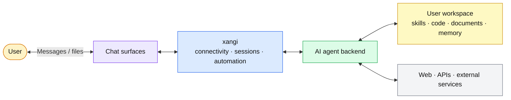

[日本語](README.md) | English

# xangi

[](https://github.com/karaage0703/xangi/actions/workflows/ci.yml)
[](https://github.com/karaage0703/xangi/releases)
[](LICENSE)

> **A**GENTIC **N**EON **G**ENESIS **I**NTELLIGENCE

xangi is an AI assistant that connects Claude Code, Codex, OpenCode, Cursor CLI, Grok CLI, Antigravity CLI, GitHub Copilot CLI, or a Local LLM to Discord, Slack, Telegram, Web Chat, and LINE. Discord is recommended, but xangi can also run with only a browser.

## Key features

- Use your preferred AI agent from Discord, Web Chat, and other chat surfaces
- Work in your own workspace containing skills and files
- Keep conversation history and switch AI backends or models per channel
- Optionally generate concise AI session titles alongside the main response
- Run automatically on a schedule or in response to external events

## Architecture



xangi handles chat connectivity, conversation continuity, and automated turns. The selected AI agent handles reasoning and tool execution, while skills and files remain in the user's workspace.

## Quickstart

The same flow works on macOS, Linux, and WSL2.

1. Prepare one supported AI tool. This example uses Codex.

   ```bash
   bash <(curl -fsSL https://github.com/karaage0703/xangi/releases/latest/download/setup-ai-tools.sh) codex
   ```

   Replace `codex` with `claude-code`, `cursor`, `grok`, `antigravity`, `github-copilot`, or `opencode` if needed.

2. Install xangi.

   ```bash
   curl -fsSL https://github.com/karaage0703/xangi/releases/latest/download/install.sh | bash
   ```

3. Open a new terminal and start guided setup.

   ```bash
   xangi setup
   ```

The guided setup currently communicates in Japanese. It lets you choose the workspace and AI backend, then starts and verifies Web Chat locally first. Tailscale and LAN exposure are optional settings offered only after the local setup works. If setup stops or you are unsure about the current state, run:

```bash
xangi doctor
```

See the [usage guide](docs/en/usage.md#first-install-without-git) for installation, updates, removal, and configuration paths.

## Start using xangi

- Web Chat: initially open `http://127.0.0.1:18888`
- Discord, Slack, Telegram, or LINE: message the configured bot
- Health check: `xangi doctor`
- Web UI URLs and reachability: `xangi tool web_status`
- Version check: `xangi --version`
- Connection settings: `xangi settings`
- If the service was not started during setup: `xangi service start`

The [usage guide](docs/en/usage.md) covers chat commands, the terminal CLI, scheduling, Docker, Local LLMs, and environment variables.

## Platform setup

- [Discord](docs/en/discord-setup.md)
- [Slack](docs/en/slack-setup.md)
- [Telegram](docs/en/telegram-setup.md)
- [LINE](docs/en/line-setup.md)
- Web Chat is configured directly by `xangi setup`

## Develop from source

This section is for xangi contributors. Source builds require Node.js 22 or later, npm, and the AI CLI you intend to use.

```bash
cp .env.example .env
npm ci
npm run build
npm start
```

For Discord, set `DISCORD_TOKEN` and `DISCORD_ALLOWED_USER` in `.env`. For Web Chat only, set `WEB_CHAT_ENABLED=true`. A source checkout uses the process startup directory as its default workspace; set `WORKSPACE_PATH` when you need a different directory.

Use `npm run dev` during development. The validation commands are `npm test`, `npm run typecheck`, `npm run lint`, and `npm run format:check`. See the [usage guide](docs/en/usage.md) for PM2, multiple instances, and key environment variables, and [.env.example](.env.example) for an annotated configuration sample.

To use Docker:

```bash
# Claude Code backend
docker compose up xangi -d --build

# Full image (also set AGENT_BACKEND=local-llm in .env to use a local model)
docker compose up xangi-max -d --build

# GPU image with CUDA and PyTorch
docker compose up xangi-gpu -d --build
```

See [Docker deployment](docs/en/usage.md#docker-deployment) for details.

## Security

- Web Chat has no application-level authentication. LAN access exposes workspace browsing and editing to the same network scope. Prefer local access or Tailscale.
- `xangi settings` binds temporarily to `127.0.0.1` and never sends stored tokens back to the browser.
- Do not paste external-service tokens into AI conversations or shell history.

## Workspace

[ai-assistant-workspace](https://github.com/karaage0703/ai-assistant-workspace) is an optional starter kit with skills for notes, diaries, transcription, Notion integration, and more.

## Extensions

Add and manage external capabilities from Extensions in the Web UI. The official catalog includes [xangi-search](https://github.com/karaage0703/xangi-search) for searching your workspace. See [Extension Integration](docs/en/usage.md#extension-integration) for details.

## Related projects

- [xangi-stackchan](https://github.com/karaage0703/xangi-stackchan) - Bridge xangi responses to an expressive M5Stack character
- [xangi-even-g2](https://github.com/karaage0703/xangi-even-g2) - Even Hub app and bridge for using xangi from Even Realities G2
- [xangi-pets](https://github.com/karaage0703/xangi-pets) - Desktop companions that display xangi state and responses

## Documentation

- [Usage guide](docs/en/usage.md) - Commands, configuration, Docker, Local LLMs, multiple instances, and troubleshooting
- [Design document](docs/en/design.md) - Architecture, components, and data flow
- [External event stream](docs/en/events.md) - SSE and device input APIs
- [Inter-instance chat](docs/en/inter-instance-chat.md) - Messaging between xangi instances

## Book

[生活に溶け込むAI — Build Your Own AI Assistant with AI Agents](https://karaage0703.booth.pm/items/8027277) (Japanese)

## Acknowledgments

xangi's concept is inspired by [OpenClaw](https://github.com/openclaw/openclaw).

## License

MIT
