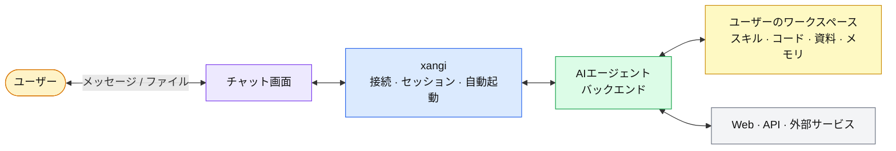

日本語 | [English](README.en.md)

# xangi

[](https://github.com/karaage0703/xangi/actions/workflows/ci.yml)
[](https://github.com/karaage0703/xangi/releases)
[](LICENSE)

> **A**GENTIC **N**EON **G**ENESIS **I**NTELLIGENCE

Claude Code、Codex、OpenCode、Cursor CLI、Grok CLI、Antigravity CLI、GitHub Copilot CLI、Local LLMを、Discord、Slack、Telegram、Web Chat、LINEから使えるAIアシスタントです。Discordを推奨しますが、ブラウザだけでも利用できます。

## 主な機能

- 好きなAIエージェントをDiscordやWeb Chatなどから利用
- スキルやファイルを置いた自分専用のワークスペースで動作
- 会話履歴を引き継ぎ、チャンネルごとにAIやモデルを切り替え
- スケジュールや外部イベントをきっかけに自動実行

## アーキテクチャ



xangiはチャット接続、会話の継続、自動起動を担当します。推論とツール実行は選択したAIエージェントが担い、スキルやファイルはユーザーのワークスペースに残ります。

## Quickstart

macOS、Linux、WSL2で共通です。

1. 利用するAIツールを1つ準備します。例はCodexです。

   ```bash
   bash <(curl -fsSL https://github.com/karaage0703/xangi/releases/latest/download/setup-ai-tools.sh) codex
   ```

   `codex`の代わりに`claude-code`、`cursor`、`grok`、`antigravity`、`github-copilot`、`opencode`も選べます。

2. xangiをインストールします。

   ```bash
   curl -fsSL https://github.com/karaage0703/xangi/releases/latest/download/install.sh | bash
   ```

3. 新しいTerminalを開いて、対話セットアップを開始します。

   ```bash
   xangi setup
   ```

セットアップでは、ワークスペースとAIバックエンドを選び、まずWeb Chatをlocalで起動・確認します。TailscaleやLANでの公開は、localの基本セットアップが完了した後の任意設定です。途中で止まった場合や状態が分からない場合は、次を実行してください。

```bash
xangi doctor
```

詳しいインストール、更新、削除、設定保存先は[使い方ガイド](docs/usage.md#gitを使わない初回インストール)を参照してください。

## 使い始める

- Web Chat: 初回は`http://127.0.0.1:18888`
- Discord、Slack、Telegram、LINE: セットアップしたbotへメッセージを送信
- 状態確認: `xangi doctor`
- Web UIアクセス先・疎通確認: `xangi tool web_status`
- バージョン確認: `xangi --version`
- 接続情報の変更: `xangi settings`
- サービスを起動していない場合: `xangi service start`

チャットコマンド、Terminal CLI、スケジューラー、Docker、Local LLM、環境変数の詳細は[使い方ガイド](docs/usage.md)にまとめています。

## プラットフォーム設定

- [Discord](docs/discord-setup.md)
- [Slack](docs/slack-setup.md)
- [Telegram](docs/telegram-setup.md)
- [LINE](docs/line-setup.md)
- Web Chatは`xangi setup`だけで設定可能

## ソースから開発する

ここからはxangi自体を開発する人向けです。Node.js 22以降、npm、利用するAI CLIが必要です。

```bash
cp .env.example .env
npm ci
npm run build
npm start
```

Discordを使う場合は`.env`に`DISCORD_TOKEN`と`DISCORD_ALLOWED_USER`を設定します。Web Chatだけで使う場合は`WEB_CHAT_ENABLED=true`を設定します。ソースcheckoutの既定ワークスペースは起動時のカレントディレクトリです。必要に応じて`WORKSPACE_PATH`を指定してください。

開発時の起動は`npm run dev`、検証用コマンドは`npm test`、`npm run typecheck`、`npm run lint`、`npm run format:check`です。PM2、複数instance、主要な環境変数は[使い方ガイド](docs/usage.md)、設定例は[.env.example](.env.example)を参照してください。

Dockerを使う場合:

```bash
# Claude Code backend
docker compose up xangi -d --build

# フル版（Local LLMを使う場合は.envでAGENT_BACKEND=local-llmも設定）
docker compose up xangi-max -d --build

# CUDA / PyTorchを含むGPU版
docker compose up xangi-gpu -d --build
```

詳細は[Docker実行](docs/usage.md#docker実行)を参照してください。

## セキュリティ

- Web Chat自体には認証がありません。LANへ公開すると、同じ範囲からワークスペースの閲覧・編集も可能になります。通常はローカル公開かTailscaleを選んでください。
- `xangi settings`は`127.0.0.1`だけで一時的に開き、保存済みtokenをブラウザへ返しません。
- 外部サービスのtokenをAIとの会話やshell historyへ貼らないでください。

## ワークスペース

スキル、メモ、日記、文字起こし、Notion連携などを含むスターターキットとして、[ai-assistant-workspace](https://github.com/karaage0703/ai-assistant-workspace)を利用できます。

## 拡張機能

Web UIの「拡張」から外部機能を追加・管理できます。公式カタログでは、ワークスペースを検索する[xangi-search](https://github.com/karaage0703/xangi-search)を提供しています。詳しくは[Extension連携](docs/usage.md#extension連携)を参照してください。

## 関連プロジェクト

- [xangi-stackchan](https://github.com/karaage0703/xangi-stackchan) - xangiの応答をM5Stackで喋らせ、表情や首振りと連動するブリッジ
- [xangi-even-g2](https://github.com/karaage0703/xangi-even-g2) - Even Realities G2からxangiを操作するEven Hubアプリとbridge
- [xangi-pets](https://github.com/karaage0703/xangi-pets) - xangiの状態と応答を表示するデスクトップ常駐ペット

## ドキュメント

- [使い方ガイド](docs/usage.md) - コマンド、設定、Docker、Local LLM、複数instance、トラブルシューティング
- [設計ドキュメント](docs/design.md) - アーキテクチャ、コンポーネント、データフロー
- [外部イベントストリーム](docs/events.md) - SSEとdevice入力API
- [インスタンス間チャット](docs/inter-instance-chat.md) - 複数instance間のメッセージ交換

## 書籍

[生活に溶け込むAI — AIエージェントで作る、自分だけのアシスタント](https://karaage0703.booth.pm/items/8027277)

## Acknowledgments

xangiのコンセプトは[OpenClaw](https://github.com/openclaw/openclaw)に影響を受けています。

## License

MIT
