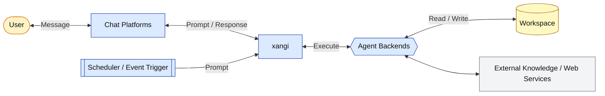

[日本語](../design.md) | English

# Design Document

This document explains the architecture and design philosophy of xangi.

## Overview

xangi is "a wrapper that makes AI CLIs (Claude Code / Codex CLI / OpenCode / Cursor CLI / Grok CLI / Antigravity CLI / GitHub Copilot CLI) and local LLMs (Ollama, etc.) accessible from chat platforms."

```
User → Chat surfaces → xangi → AI agent → Workspace
```

## Architecture



### Layer Structure

| Layer              | Role                                     | Implementation                                                                                               |
| ------------------ | ---------------------------------------- | ------------------------------------------------------------------------------------------------------------ |
| Chat               | User interface                           | discord.js, @slack/bolt, grammy, http (Web Chat), @line/bot-sdk                                              |
| xangi              | AI CLI / Local LLM integration & control | runner-manager.ts, dynamic-runner.ts, agent-runner.ts                                                        |
| Backend Resolution | Per-channel backend resolution           | backend-resolver.ts, settings.ts                                                                             |
| AI Backend         | Actual AI processing                     | Claude Code, Codex CLI, Cursor CLI, Grok CLI, Antigravity CLI, GitHub Copilot CLI, Local LLM (Ollama / vLLM) |
| Workspace          | Files & skills                           | skills/, AGENTS.md, local docs                                                                               |

## Components

### Entry Point (index.ts)

A thin entry point dedicated to the startup sequence. It is responsible only for the following; the actual implementation of each feature lives in separate modules:

- Configuration loading and validation (`config.ts` / `config-validate.ts`)
- Startup branching for the enabled clients (Discord / Slack / Web Chat / LINE / Telegram; a Web-only setup does not create a Discord Client)
- Discord, Slack, LINE, and Telegram begin startup concurrently. Discord and Slack use `platform-startup-retry.ts` to retry only transient DNS, timeout, and reset failures in the same process with exponential backoff capped at 60 seconds. Telegram uses its existing Bot API, webhook registration, and polling retries. LINE and Telegram webhook startup waits for the HTTP server's actual `listening` event, while Telegram polling waits for its first `onStart`. Web Chat and the other chat clients remain available while one connection is waiting. Permanent errors such as invalid credentials, a webhook port conflict, or a permanent polling stop terminate the process with a non-zero exit code
- Starting the scheduler and the various HTTP servers (tool-server / events-stream / event-trigger, etc.)
- SIGTERM/SIGINT handling. After finalizing active streaming displays, xangi sends SIGTERM to managed agent CLI processes, waits for their actual exit, and only then stops extensions and releases the data-directory lock. Child processes that miss the deadline are escalated to SIGKILL
- Restart requests from Slack, Discord, Web, and the agent tool all signal the xangi process with SIGTERM so they always pass through the same graceful-shutdown path

### Discord Integration (src/discord/)

Based on `discord.js` v14. Split into modules by responsibility:

- `message-handler.ts` — MessageCreate/Update/Delete handling and `processPrompt` (mention / DM / `discordAutoReplyChannels` in `settings.json` → forwarding to the Runner; Discord system messages are ignored)
- `turn-coordinator.ts` — The shared `DiscordTurnCoordinator`, which owns active state and the FIFO wait queue for schedule / trigger turns per `conversationKey`
- `slash-commands.ts` — Slash command definitions and interaction handling
- `scheduler-bridge.ts` — Registers the scheduler's Discord sender and agent-runner functions. It submits schedule / trigger turns to the shared coordinator and registers their processing messages with the processing-message UI so Stop / extend / remaining-time controls match the normal message path
- `ui.ts` — Button rows (Stop / extend / remaining-time display) and processing-message management
- `tool-history.ts` — Tool history formatting/accumulation (display lines capped via `TOOL_HISTORY_MAX_LINES`)
- `message-utils.ts` — Discord message link expansion, reply quoting, thread-starter quoting, channel-mention expansion

Behavior:

- Per-channel / per-thread session isolation (`contextKey = discord:<channelId>`; when thread-reply mode creates a new thread, `discord:<threadId>`)
- Discord API posting targets the parent channel or the created thread, while runner / timeout / Stop / processing state use the resolved `runKey = contextKey`, so separate threads in the same Discord channel do not share an execution slot. Thread prompts include both the parent channel name/ID and thread name/ID so the agent can target either one without another lookup
- Normal messages and Web continuations of Discord sessions retain the existing processing notice / busy error when the same `conversationKey` has active or queued work. Schedule / trigger turns instead wait in arrival-order FIFO behind active work for that key; different keys can run concurrently, and a failed predecessor does not prevent the next queued turn from starting
- The shared wait queue is in-memory and non-durable, with no restoration after process restart. This coordination applies only to Discord paths; execution behavior for non-Discord platforms is unchanged
- Per-channel settings inside Discord threads normally resolve through the parent channel ID. `CHANNEL_OVERRIDES` (`/backend` / `/llmmode`), `settings.json` (`/notify` / `/threadmode`), and channel topic injection inherit the parent channel configuration. `/autoreply` is the exception: it stores an explicit override under the thread ID and inherits the parent value only when the thread has no override
- For messages inside an existing Discord thread, xangi injects the starter message from the parent channel as `🧵 スレッド元` so the agent focuses on the thread's original topic even when thread-local history does not include it
- Threads, attachments, and reactions supported
- Streaming display uses `stream-session.ts` (a core shared with Slack / Web) to unify thinking display and update throttling, and refreshes the button UI at 1-second granularity via `message.edit`
- On process shutdown (SIGTERM), `stream-finalizer.ts` finalizes in-flight streaming displays into a "⏸ interrupted by process restart" notice (registered on both the message-handler and scheduler-bridge paths)

### Slack Integration (slack.ts)

Based on `@slack/bolt`.

- Handles `app_mention` and DMs; per-thread session isolation (`contextKey = <channelId>:<threadTs>`)
- Handles normal `message` events, user `/me` posts (`me_message`), and attachment-bearing `file_share` events, while ignoring other Slack system subtypes such as channel renames
- Handles follow-up messages without mentions inside active threads that xangi started from a mention, while ignoring unrelated thread replies in non-auto-reply channels
- Keeps Slack API posting on `channelId`, but uses `runKey = contextKey` for runner / timeout / Stop / processing state so separate threads in the same Slack channel do not share an execution slot
- Resolves backend settings with the parent `channelId` while keeping runner execution on `runKey`. `/backend set/show/reset` updates both `CHANNEL_OVERRIDES` and the live resolver, then discards existing thread sessions and runners in that channel so the next message switches without a restart
- Prevents duplicate runs with a per-`runKey` busy lock, message timestamp de-dupe, and message-handler bot-mention skip so `app_mention` owns mention events
- Shows formatted tool-history lines while a Slack turn is running, then exposes chronological commentary and tool history through a user-only `History` button in the source thread. The button retains a turn reference so persisted history can be restored after a process restart
- Slash commands and reactions supported
- Stop / extend / remaining-time button rows are refreshed every second via `chat.update`
- `completion-summary.ts` standardizes completion displays across platforms
- For non-thread turns, xangi posts that separate completion notice after long runs to improve visibility

### Web Chat (web-chat.ts)

- Message permalinks use `/chat/<appSessionId>#message-<messageId>` and are available for every transcript entry originating from Web, Discord, or Slack. The React app restores the target session, pages backward when needed, then scrolls to and highlights the message. When Discord or Slack input contains a permalink for the same instance, `session-reference.ts` verifies both IDs and adds only that message as an untrusted quoted block rather than instructions. The IDs are reference keys, not authentication credentials

Lightweight server based on `http.createServer` (no Express dependency).

With `WEB_CHAT_ENABLED=true`, it serves both the Web UI and APIs. A headless setup with only `XANGI_EVENTS_SERVER_ENABLED=true` starts the same server but exposes only health, event SSE, session reads, and pet/device/terminal inbox routes; Web UI assets and unrelated Web APIs return 404.

- A single React + TypeScript + Vite screen builds into `web/app` and is served on `WEB_CHAT_PORT`
- Discord sessions expose two continuation paths: a Web branch that inherits history, and remote input that mirrors the message through the bot and directly processes the same Discord `contextKey` / appSessionId. The latter bypasses the bot's own `MessageCreate` event to avoid loops. Sessions originating from Discord or Slack resolve their original chat URL through a dedicated API and expose it in the Web Chat pane header. Web branches retain a source-session ID that remains available after history injection
- Primary interactions are limited to creating a conversation, searching/selecting the latest 100 sessions, showing the latest 50 messages, and streaming responses over SSE
- Attachment uploads use `XMLHttpRequest.upload` progress events to show the file name, position within a multi-file selection, and transfer percentage above the composer on both desktop and mobile
- Workspace and uploaded files honor byte `Range` requests with `206 Content-Range`, allowing media elements including iPhone Safari to load metadata, seek, and play. Unsatisfiable ranges return `416`
- A transient session-detail read failure appears only after the safe GET retries are exhausted. A later successful read clears that read error without hiding a newer send or upload error
- Web Projects are logical namespaces equivalent to Discord channels. Names, extra prompts, and optional backend/model/effort defaults are stored in `DATA_DIR/web-projects.json`, and sessions refer to them through `projectId`. An existing Web session can change or clear its `projectId` while it is idle. Creating a Project never creates a directory, Git repository, or instruction file. An invalid Project entry is skipped in isolation, while unavailable backend/model/effort settings are disabled for that Project so the rest of xangi can keep starting
- The Web Projects screen registers existing absolute paths in the central workspace registry and can unregister unused workspaces. Unregistering never changes the directory or its files and is rejected for the default workspace, Project or existing-session references, and platform channel bindings
- `xangi service restart` and `xangi tool system_restart` use the new CLI to validate the production Web Project state read-only before requesting a restart. An incompatible state blocks the restart without modifying the state file
- Web backend resolution uses conversation override (`/backend set`) first, then the Project default, then the runtime default. `/backend reset` removes only the conversation override. If moving a conversation changes provider backend, xangi does not reuse the old provider session ID and preloads the saved transcript into the next turn to preserve context
- `GET /api/sessions` returns the latest 100 sessions plus `activity` and a `sessionMode` that describes whether provider context can continue, and supports server-side `lifecycle=open|closed` and `updatedSince` filters. `GET /api/sessions/:id` also returns `isActive` and `activity`, allowing Web Chat to recover from a broken send SSE by observing the same server turn or loading its persisted transcript. The POST is never retried automatically. Title derivation reads the first JSONL line in chunks instead of each complete log
- Project filtering happens server-side in both `GET /api/sessions` and `GET /api/sessions/stream`. Typing in search no longer reconnects SSE, and the redundant initial search request is skipped
- `/monitor` is the session-monitoring mode of the same React app. It presents Sessions in three columns: Running, Waiting for input, and Completed, without exposing the internal Open / Closed lifecycle. A stateless extension backend with no provider-side context appears only while its request is running; after the response completes it is omitted from both Waiting and Completed while its conversation log remains in Chat. Completed Sessions are limited to the last 24 hours by default. Errors and aborted turns stay in Waiting and use the card's status label and colored dot instead of a separate column. The detail panel can open the conversation or mark the Session completed through `POST /api/sessions/:id/close` while preserving history. For multi-step work, the agent explicitly calls the `progress_card` tool to replace the Session plan. The durable plan stores `pending`, `in_progress`, and `completed` steps plus an optional note in `DATA_DIR/sessions.json`, with at most one current step. Collapsed Monitor cards show the current step and completed-step count, while details show every step with textual Pending / Current / Completed labels. Neither view infers a percentage. Completed history keeps the existing actions for continuing in the original Discord conversation or branching into a history-inheriting Web conversation. Account windows retrieved from an official structured source are shown regardless of whether that provider has a current Session and refreshed from `GET /api/usage` every 60 seconds. Provider cards can be collapsed or hidden. Per-Session context usage and progress-card updates are persisted and pushed in SSE snapshots. Chat also presents the model, the currently effective runner cwd, and context usage in a compact status line below each pane. Each snapshot resolves cwd from the Session workspace snapshot, or the current default workdir when absent, matching the runner workdir injected into every turn's runtime context. `GET /api/sessions/stream` carries turn-boundary, context, and progress snapshots, so the Session list is not polled.
- `/workspace` is the workspace browser/editor mode of the same React app. `workspace-browser.ts` accepts workspace-relative paths and normalizes absolute paths that remain inside `WORKSPACE_PATH`; hidden/state/dependency/build paths, symlinks, non-text files, and files larger than 1 MiB remain unavailable. Web Chat text-file links become `/workspace?path=...&line=...` deep links that open the parent directory and file, then select the requested line. `MEDIA:` inside fenced, inline, or indented code is excluded from media splitting so only real media notation leaves the Markdown stream. Markdown YAML frontmatter provides `tags` for filtering, and files can be sorted by name or modification time. Saves compare the SHA-256 captured at read time and atomically rename a temporary file in the same directory. External changes return 409 so the UI can require a reload
- `/schedules` is the schedule-management mode. Its HTTP APIs add, edit, enable, disable, and delete jobs for Web, Discord, Slack, and Telegram. Web jobs store a reserved new-conversation value as `channelId` plus an optional `projectId`. At run time the Project is validated again, a fresh Web session is created, and the normal Web agent-runner path appends the turn to that session
- `agent-runs.ts` atomically persists an isolated execution ledger for comparisons and delegation at `DATA_DIR/agent-runs.json` with mode 0600. `POST /api/agent-runs` creates a fresh Web session with a fixed backend, model, effort, and registered workspace, then runs it asynchronously through the existing Dynamic Runner. The ledger keeps the task SHA-256, session IDs, status, duration, and backend-native usage; it stores a trajectory path only when the file was actually created. `GET /api/agent-runs` and `GET /api/agent-runs/:id` expose the manifests. The first version intentionally excludes gates, automatic repair, and parallel benchmark orchestration
- Chat, Files, Schedules, Monitor, and Extensions share one navigation shell. It becomes a left activity rail on desktop and a bottom navigation bar at 768 px and below or on short touch landscapes; Monitor, Extensions, and the theme selector move into the More sheet on those compact layouts. The system/light/dark preference is stored in localStorage and switches semantic color tokens through `data-theme`. Monitor displays an active Session as Running, an inactive Open Session as Waiting, and a Closed Session as Completed. Internally, `lifecycle` still tracks Open / Closed while `isCurrent` remains the separate next-input routing pointer. Existing sessions without `lifecycle` are Closed regardless of stale routing pointers and become explicitly Open only when they receive the next input
- React is bundled into static assets at build time, so distributed installations add no frontend runtime dependency beyond Node.js

### macOS, Linux, and WSL2 setup and update core

- `installer/layout.ts` separates application versions from workspace, state, and configuration. A future Windows adapter uses the same logical layout
- `installer/manifest.ts` and `updater.ts` provide Ed25519 and SHA-256 verification, an update lock, staging, and atomic current switching. Initial service activation performs a health check and rolls back on failure
- `installer/platform/darwin.ts` owns LaunchAgent behavior, keeping OS-specific lifecycle code outside the shared updater
- `installer/platform/linux.ts` owns the XDG layout and `systemd --user` lifecycle. It emits `WorkingDirectory=` without quoting the whole value and escapes spaces and other special path characters with systemd path syntax. WSL2 requires systemd; setup URLs use `wslview` when available and otherwise open in the Windows browser through `cmd.exe`
- `setup/guided-onboarding.ts` deterministically detects supported agent CLIs through `PATH`, `NVM_BIN`, `~/.nvm/versions/node/*/bin`, and `--version`. The detected absolute executable path is shared by the service PATH and runner. It sends only a short start prompt to the agent UI, stores detailed instructions in a temporary mode-0600 file, and removes that file when the agent exits. The initial flow fixes Web Chat to local access and does not inspect Tailscale until the service starts and `doctor` succeeds. Only after the local setup works does the agent offer Tailscale or LAN as optional access settings. `setup --access` changes only the access scope without returning completed onboarding to the bootstrap phase. Local and Tailscale modes keep the runtime on loopback; Tailscale adds a same-port TCP forward through Tailscale Serve only after the user selects it. LAN mode warns that Web Chat has no application-level authentication before binding to `0.0.0.0`. xangi's `setup --apply` and `setup --complete` remain responsible for configuration persistence, workspace-mode validation, repository-template application, and BOOTSTRAP completion checks
- `onboarding.json` atomically records `preflight`, `bootstrap_in_progress`, and `minimum_ready` in the configuration area as the source of truth for resume and diagnostics. There is no browser UI that replaces AI onboarding; when no supported agent is available it prints installation guidance and exits
- `secrets.json` is atomically stored with mode 0600 in the OS-specific configuration area. `xangi settings` opens a temporary GUI for Discord allowed-user IDs and tokens on loopback with a one-time URL, Host validation, no-store, and CSP. It never sends stored values to the browser and closes after saving, keeping connection settings out of the AI, workspace, setup JSON, and shell history
- `packaging/bootstrap.sh` is published as the shared `install.sh` entry point for every supported operating system. It detects Darwin / Linux and arm64 / x64, then dispatches to the target installer in the same GitHub Release. WSL2 follows the Linux path. A piped invocation always defers setup and service activation, installs the verified CLI, and tells the user to run `xangi setup` from a normal terminal. Shell/readline and an AI TUI never hand terminal ownership to each other inside the pipe
- `packaging/build-bundle.sh` packages the compiled runtime, production dependencies, documentation, and only the three allowlisted Web Chat HTML assets; it excludes `web/node_modules` and secret candidates. `packaging/build-installer.mjs` verifies the signed manifest and bundle during the release build, then embeds the manifest and artifact SHA-256 values plus the Ed25519 public key into each target installer. Later updates use the persisted public key. The target installer verifies the Node runtime, CLI entry point, and Web UI assets before committing the verified bundle, atomic `current` symlink, stable launcher, and `~/.local/bin/xangi` ahead of AI onboarding. External AI or service failures do not roll back the distribution, leaving `xangi setup` or `xangi install` available for recovery
- `.github/workflows/release-assets.yml` builds Darwin / Linux × arm64 / x64 bundles on native runners and limits the Ed25519 private key to the final manifest-signing job. Each installer receives a version-pinned artifact URL and a `releases/latest` manifest URL for update discovery, while bundles, manifests, installers, and checksums are attached to the same GitHub Release
- `workspace-template.ts` resolves the selected GitHub repository branch to its latest commit at selection time, downloads the commit-pinned archive without Git, records repository, commit SHA, and archive SHA-256, and atomically seeds an empty workspace. Normal install/update flows apply it only once. When the user explicitly selects template mode again during setup, xangi may safely reseed a missing or empty target even if prior application state remains. A workspace containing user files is never modified
- `platform/*-update.ts` manages a six-hour signed-channel check through LaunchAgent or a systemd user timer
- `xangi uninstall` uses the existing update-scheduler and service adapters to stop and unregister them before removing only the application root. Configuration, state, and workspace live outside the app and are retained by default; only explicit `--purge --yes` also removes configuration and state. The workspace is never an uninstall target
- Managed services enter through the execution-only `installer/runtime-config-main.ts`, which maps setup configuration into environment variables before importing the runtime. The `runtime-config.ts` library has no direct-execution path comparison, so the `current` symlink cannot suppress startup when its path differs from the resolved module path
- the common setup config is consumed by both managed services and checkout PM2 services. The checkout ecosystem receives only the non-secret config and state paths
- checkout `update` validates a clean worktree, branch, and upstream before `git pull --ff-only`, dependency installation, and build. `--managed` selects the signed managed updater
- checkout `doctor` detects PM2 and realpath-compares the Web Chat workdir reported by `/api/sessions` with the saved setup config. For Tailscale access it also verifies that Tailscale Serve forwards the effective Web Chat port to loopback
- `extensions.ts` stores only explicitly linked `xangi-extension.json` manifests in a mode-0600 `${DATA_DIR}/extensions.json` registry, isolated from instances using another DATA_DIR under the same OS user. At startup, the legacy per-user registry migrates only entries whose manifests are below the current `${DATA_DIR}/extensions/sources/`; entries owned by other instances are not copied. A schema-v2 manifest declares a relative entrypoint, a `managed-http` runtime, HTTP capabilities, and an optional UI path; it contains no fixed URL or port. xangi starts `serve --workspace <path>` as a child process and accepts only an OS-assigned `127.0.0.1` URL from its readiness JSON. A parent-generated bearer token is shared only with the child and internal proxies. Every child receives `XANGI_EXTENSION_INSTANCE_ID`; when Web Chat is enabled it also receives `XANGI_EXTENSION_HOST_URL` resolved from the effective bind settings, and when event delivery is enabled it receives `XANGI_EXTENSION_EVENTS_URL`. Successful validation of the readiness schema, ID, workspace, and loopback URL is the runtime-registration boundary. An initial health timeout, non-2xx response, or `ready: false` after that boundary is a recoverable cold-start state and does not stop or unregister the child. Status reports `running` (live process), `healthy` (2xx health response), and `ready` (a 2xx payload that is not explicitly `ready: false`) separately; legacy extensions that omit `ready` are treated as ready. Closing stdin or shutting down xangi stops the child
- The Web UI at `/extensions` shows xangi-search from the official curated catalog even on a first run with empty environment and state. The display catalog secures official entries first and treats configured manifests, repository sources, the linked registry, and status checks as independent inputs. If one input has an unsupported schema, malformed JSON, or a missing file, the API still returns the official and other valid entries with HTTP 200 and reports the partial failure through `degraded` and `issues`. Listing never migrates an old schema, repairs state, or fetches a replacement from the network. When an extension is linked, its linked manifest is the source of truth for displayed metadata. Repository metadata and update actions are associated only when the repository and linked manifests resolve to the same canonical path. If runtime state cannot be determined, the UI shows an unknown state instead of claiming that the extension is not installed and disables its actions. Mutating paths such as repository registration, setup, and update retain strict validation. Merely listing an official entry performs no network fetch or code execution; selecting Add starts public GitHub repository validation, retrieval, and a dedicated setup conversation. An extension linked earlier through the CLI or deployment tooling retains a separate Setup action that opens the same dedicated conversation instead of treating the installed state as completed setup. Local manifests preconfigured through `XANGI_EXTENSION_DEV_MANIFESTS` and public GitHub repositories added by the user are merged into the same catalog. It accepts only repository-root `https://github.com/owner/repository` URLs, uses no credentials, and verifies that the repository is public. xangi resolves the default branch to a commit SHA, downloads a commit-pinned tarball with a 50 MB limit, requires one archive root containing only regular files and directories, and atomically extracts it under `${DATA_DIR}/extensions/sources/`. It validates a root `xangi-extension.json` and stores the repository URL, commit SHA, archive SHA-256, addition time, and available license in mode-0600 `${DATA_DIR}/extension-sources.json`. No extension code runs at this stage. Add creates a dedicated Web session and selects repository-local setup instructions in this order: manifest `setup.instructions`, `XANGI_SETUP.md`, then `README.md`. The LLM treats those instructions as reference material that cannot override higher-level instructions, and receives the current xangi instance's extension registry path through the safe environment. The low-level install API links the manifest and asks the parent-process runtime manager to start it; remove stops and unlinks it without deleting extension code or data. Extensions that declare a UI gain an Open action backed by a same-origin proxy. The proxy uses only the running capability target and injects its private bearer token; browsers cannot submit an arbitrary upstream or token, and mutations are accepted only from the Web UI host
- Normal removal from the Extensions page does not unlink immediately; it starts a dedicated LLM conversation with the linked manifest's setup document and README. The LLM identifies extension-specific hooks, skills, `AGENTS.md` rules, schedules, and other workspace settings, presents an exact diff and retained items, and performs a minimal cleanup only after approval. It then invokes the parent process's fixed `extension_uninstall` tool instead of an arbitrary CLI found on `PATH`. The tool stops and unlinks in the current instance, verifies the registry and runtime state, and returns completion, linkage, hook reload timing, and restart requirements. Source and extension data remain by default, while a full purge requires separate approval. The low-level `DELETE /api/extensions/:id` remains available for automation and compatibility and only stops and unlinks
- Updates for repository-managed extensions begin in a dedicated `Update: <displayName>` Web session created from the Extensions UI. Any linked public GitHub source whose manifest declares `update.prepare.command` and `args` is eligible; the mechanism does not depend on a particular ID, repository, or package manager. The default branch's target commit SHA is pinned when the conversation starts. The LLM explains the plan, obtains any required approval, and reports the result, but it does not perform an arbitrary shell or Git update. The parent-process `extension_update` transaction takes the source lock, revalidates the target and current SHAs, validates the candidate manifest, stops the extension, atomically swaps the source, runs update preparation at the final path, relinks the registry, starts, and runs `doctor`. Preparation passes the manifest's program and arguments separately to `execFile` without a shell. Added permissions or capabilities and changed entrypoints, agent backends, UI mappings, or update preparation stop before the swap unless explicitly approved. A post-swap failure restores the old directory and registry, then starts and doctors the old version only when it had been running before the update. The source commit SHA and `updatedAt` are atomically persisted only after success. After a successful update, the same LLM rereads the manifest's setup document from the updated source and compares bundled skills with same-name workspace skills and related `AGENTS.md` rules. It proposes a workspace change only for material API, workflow, or always-on policy differences, stating the reason, target paths, and summary. Workspace edits require separate explicit approval and preserve user-specific rules through a minimal diff. Formatting-only differences, automatic workspace updates, local manifests without a managed repository source, and background automatic updates are out of scope
- An extension setup request resolves the repository-root README separately from the setup document. If the setup document contains a setting, workspace change, or optional feature that requires approval, the LLM presents the material difference, impact, and choices instead of converting it into a generic recommendation or future request. It neither applies the change before approval nor reports setup as complete while a choice remains pending, and it continues in the same setup conversation after the reply. After setup, status, and doctor succeed, the LLM uses only that README plus the workspace README, AGENTS.md, and top-level directory structure to understand the user's goals and existing workflow. It then proposes two or three uses with a fit rationale, the first request or action, and the expected result. The recommendation phase is read-only; workspace or settings changes, automation, external sending, and scheduled execution require separate explicit confirmation.
- Extensions with `autostart` enabled start with the xangi process. Startup logs distinguish extensions that are ready from processes that started but are still warming. The global `doctor` aggregates extension checks and reports `ready: false` as an error, while one failed or warming extension does not prevent unrelated chat platforms from starting; use of its capability returns an explicit error
- Capability-specific adapters remain separate from the shared lifecycle. The `workspace.search` adapter resolves the running URL from parent-process memory and injects the parent-only authorization header. Multiple xangi instances therefore own distinct child processes, automatically assigned ports, and workspaces. Each extension repository remains canonical for extension-specific implementation and operations
- `src/cli/xangi-main.ts` is the execution-only CLI entry point. It unconditionally invokes the `run()` exported by `src/cli/xangi.ts` and maps top-level errors to process exit codes. The CLI library does not decide whether to run by comparing `import.meta.url` with `process.argv[1]`, so the managed `~/.local/bin/xangi → app/bin/xangi → current → dist/cli/xangi-main.js` symlink chain has one unambiguous execution boundary
- A checkout's `bin/xangi` runs current `src/cli/xangi-main.ts` through local `tsx` and never selects an ignored, stale `dist/` tree. A distribution has no source tree, runs its bundled `dist/cli/xangi-main.js` and Node.js runtime, and allowlists the README and user-facing documentation used as onboarding sources
- `notionSyncEnabled` is a global gate that defaults to off. Status and disable do not contact the Notion API, and a normal run is rejected before an adapter is created. Only an explicit `run --once` bypasses the gate; disabling preserves sync state and backups for a later resume

### LINE Bot Integration (line.ts)

1:1 chat via LINE Messaging API. Design:

- `http.createServer`-based (matches `web-chat.ts`, avoids the Express dependency)
- Uses `@line/bot-sdk`'s `validateSignature` for raw-body + `X-Line-Signature` HMAC-SHA256 verification
- Passes text messages through `runWithBubbleEvents` to the Runner, then replies via `LineBotClient.replyMessage`
- Per-userId session isolation (`contextKey = line:<userId>`)
- `LINE_ALLOWED_USER` whitelist (`*` allows all, empty causes a startup error)
- Acks the webhook immediately (LINE expects HTTP 200 within 30 s; the rest is async)

#### Two-stage responsiveness defense (loading animation + reply→push auto-switch)

LINE has no thread or "new chat" UI boundary like Slack or Discord, and reply tokens expire 60 s after the inbound event. Long thinking time or local-LLM tool loops can easily turn into "ghosted" experiences. Two layered defenses cover this:

1. **Instant ACK — Loading animation API**: Right after the allowlist check (before the runner starts), `handleEvent` calls `client.showLoadingAnimation({ chatId, loadingSeconds })` which hits LINE's official `POST /v2/bot/chat/loading/start`. The "typing…" indicator appears in the chat immediately and disappears when the bot sends its next message. Failure is non-fatal (`console.warn` only). DM-only feature (groups are ignored by LINE, but the API call still succeeds). Duration is controlled by `LINE_LOADING_ANIMATION_SECONDS` (default 60; `snapLoadingSeconds` snaps to one of 5/10/15/20/25/30/40/50/60). Disable with `LINE_LOADING_ANIMATION_ENABLED=false`.

2. **Reply→Push auto-switch — Slow response fallback**: A `setTimeout` armed with `LINE_SLOW_RESPONSE_THRESHOLD_MS` (default 45000 ms). When it fires, the reply token is consumed by sending `🤔 ちょっと待ってね、考えてる…` (the `slowFiredRef` flag is set). After the runner finishes, the send path is chosen from `slowFiredRef.value` and `elapsedMs`:
   - `slowFiredRef.value === true` → reply token consumed; must use Push API
   - `slowFiredRef.value === false` and `elapsedMs < threshold` → reply token still valid → use reply
   - Otherwise → safe fallback to Push

   If reply fails afterwards, push is retried as a secondary fallback (both failures are logged via `console.error`). Set `LINE_SLOW_RESPONSE_ENABLED=false` to disable, but responses over 60 s would then be lost entirely (not recommended).

   The Push API is free for the first 200 messages/month on personal Official Accounts; usage beyond is billed. If slow responses are frequent on a local LLM (Gemma, etc.), increase the threshold or use a faster inference backend.

#### Session boundaries (idle reset + reset command)

LINE has no explicit conversation boundary UI like Slack's threads or Discord's "new chat" button. xangi switches sessions using a two-layer time-based + command-based approach:

1. **Reset-command detection**: In `handleEvent`, right after the allowlist check and before the loading animation or runner, `isResetCommand(text, patterns)` checks for an exact match (case-insensitive, whitespace stripped). On match, the active session is archived via `archiveSession()`, a new one is created via `ensureSession()`, "最初からお話するね！何かあった？" is sent via `replyMessage`, and the function returns without invoking the runner. Default patterns are limited to three unambiguous slash commands: `/reset` `/new` `/clear`. The idle reset (time-based) is the primary boundary; commands serve as a manual escape hatch. Japanese natural-language phrases have fuzzy boundaries against neighboring phrases ("リセットってどういう意味？", "最初からお話したい"), so they are excluded from defaults and must be added explicitly via `LINE_RESET_TEXT_PATTERNS` (CSV) if needed.
2. **Idle session reset**: For non-reset messages, if the current session's `updatedAt` is older than `LINE_IDLE_RESET_HOURS` (default 4 h), `hasSessionGoneIdle()` returns true → `archiveSession()` is called, then `ensureSession()` creates a new session. Children's conversations cluster naturally around school / sleep / meal patterns, so 4 h is a good cut. The `logs/sessions/*.jsonl` files are kept after archiving, so history is preserved.

Both features can be disabled independently (`LINE_IDLE_RESET_ENABLED=false`, `LINE_RESET_TEXT_PATTERNS=`). Combined with Rich Menu button bindings ("Start over" → sends `リセット` → reset-command detection path), this gives a clean integrated experience.

The public endpoint is provided externally (Tailscale Funnel / Cloudflare Tunnel). See [`docs/en/line-setup.md`](line-setup.md).

### Telegram Bot Integration (telegram.ts)

Supports messaging via Telegram Bot API. Design:

- Uses `grammy` library. Supports both webhook and long polling startup modes (long polling is the default).
- Monitors text, photos, videos, and documents with allowed MIME types, and processes only DMs and authorized group chats. Media reception is explicitly opt-in.
- Performs allowlist validation for authorized user IDs (`TELEGRAM_ALLOWED_USER`) and authorized bot IDs (`TELEGRAM_ALLOWED_BOTS`).
- For group chats, begins responses on bot mention, reply to bot, or message detection in `TELEGRAM_AUTO_REPLY_CHATS`.
- Strips the `@xangi_bot` mention automatically before passing text to the Runner.
- Implements an infinite reply loop guard (`TELEGRAM_ALLOWED_BOTS_MAX_CONSECUTIVE`) that caps consecutive replies to the same bot.
- Updates the thinking/streaming process inline using `editMessageText` at a 1-second interval powered by `StreamSession`.
- Stores inbound media only after authorization, validates size, MIME metadata, and signatures for known formats, groups one album into one agent turn, and removes stored files according to the retention setting.
- Serializes media download through agent execution in a per-chat queue. Generation checks invalidate old work after `/new` or `/stop`, and discard files already downloaded by invalidated work.
- Classifies structured agent attachments as images, MP4 videos, or other documents for Telegram delivery. It does not automatically retry attachments with ambiguous delivery status, avoiding duplicate uploads.
- Caps individual messages to Telegram's 4096-character limit and splits longer text using `splitMessage`.
- Handles session reset commands (`/reset`, `/new`, `/clear`), cancellation of running, queued, and media-download work (`/stop`), and simple help guidance (`/help`).

### Agent Runner (agent-runner.ts)

An interface that abstracts AI CLIs:

```typescript
interface AgentRunner {
  run(prompt: string, options?: RunOptions): Promise<RunResult>;
  runStream(prompt: string, callbacks: StreamCallbacks, options?: RunOptions): Promise<RunResult>;
  cancel?(channelId?: string): boolean;
  destroy?(channelId: string): boolean;
  hasRunner?(channelId: string): boolean;
  /** Returns the active request's timeout state for UI countdown */
  getTimeoutState?(channelId: string): TimeoutState;
  /** Called by the +5m button to extend the active request's timeout */
  extendTimeout?(channelId: string, additionalMs: number): ExtendTimeoutResult;
}
```

Extensions can join the same interface through an `agentBackend` declaration in their manifest. xangi's `ExtensionAgentRunner` owns only the shared HTTP contract and transcript persistence; search, formatting, and model-specific behavior remain in the extension. See [Extension Integration](usage.md#extension-integration) for the installation flow.

Session-oriented Runner implementations (Claude Code / Codex / Cursor / Grok / Antigravity / GitHub Copilot / Local LLM / Dynamic) are also
`EventEmitter`s and emit `timeout-started` / `timeout-extended` / `timeout-cleared`
events so upstream consumers (web-chat SSE / Discord bot / Slack bot) can refresh the UI. Single-request HTTP adapters do not expose these timeout events.

### Activity Store (activity-store.ts)

`runWithBubbleEvents` updates a lightweight snapshot of the current turn from the shared lifecycle.

- `turn.started` equivalent sets `thinking`
- `onText` sets `streaming`
- `onToolUse` sets `tool` and records recent tool lines
- `onComplete` / cancel / error set `complete` / `aborted` / `error`
- When a caller supplies `eventTextSanitizer`, activity and shared events receive sanitized display text while the raw Runner response remains available for transcripts
- Current-state snapshots remain process-memory only. Commentary and tool boundaries are appended chronologically to `logs/monitor-activity/*.jsonl`; the final streamed segment is omitted because the assistant reply already preserves it
- `sessions.json` and conversation transcript formats remain unchanged. Web Chat lazily loads History through `GET /api/sessions/:id/turn-history`
- `GET /api/sessions` and the Even Terminal compatible `GET /api/sessions?provider=...` read the same activity data

### Timeout Controller (timeout-controller.ts)

A shared helper that centralizes per-channel timeout state for every runner:

```typescript
class TimeoutController extends EventEmitter {
  start(channelId, onTimeout): void; // start request + emit 'timeout-started'
  clear(channelId, reason): void; // completed / error + emit 'timeout-cleared'
  extend(channelId, additionalMs): ExtendTimeoutResult; // extend + emit 'timeout-extended'
  getState(channelId): TimeoutState; // UI consumption
  clearAll(reason): void; // shutdown cleanup
}
```

- `start()` schedules `setTimeout(onTimeout, baseTimeoutMs)`
- `extend()` reschedules the timer and rejects with `max_timeout_exceeded` if the new
  deadline would exceed `maxTimeoutAt` (request start time + 1 hour)
- `onTimeout` looks up the _current_ AbortController / child process so that retries
  swapping out the underlying resource still get killed on timeout

### Dynamic Runner Manager (dynamic-runner.ts)

A wrapper that dynamically switches backend, model, and effort per channel:

```
Message received
  → BackendResolver.resolve(channelId)
  → Retrieve { backend, model, effort }
  → DynamicRunnerManager routes to the appropriate runner
  → Execute
```

BackendResolver priority:

1. channelOverrides set via `/backend set` (in-memory, persisted to CHANNEL_OVERRIDES in `.env`; Discord threads resolve through the parent channel ID)
2. Defaults from `.env` (`AGENT_BACKEND`, `AGENT_MODEL`)

`backend-effort.ts` centralizes the effort levels supported by each backend. `/backend set` and `CHANNEL_OVERRIDES` loading validate the backend/effort pair and never save or apply unsupported values. Each runner translates a resolved effort into effective CLI arguments.

### System Prompt (base-runner.ts)

Manages the system prompts that xangi injects into AI CLIs:

- **Chat platform info** — A short fixed text indicating the conversation is via Discord/Slack
- **XANGI_COMMANDS** — Keeps only runtime contracts such as long-running work, self restart, `MEDIA:`, and platform-specific identifiers in the persistent prompt
  - Command usage is stored in `xangi tool help <topic|command>` metadata and loaded only when needed
  - User-facing slash commands keep each platform's `/help` and command metadata as their source of truth
  - When the platform is unknown, no platform-specific rules are injected, preventing Discord and Slack instructions from being mixed
- **Platform identification** — Each message is annotated with `[Platform: Discord]` or `[Platform: Slack]`. The AI uses the appropriate commands accordingly
- **Turn-history display** — The shared event layer persists streamed commentary and tool calls chronologically for every backend. Discord keeps the compatibility setting `DISCORD_TOOL_HISTORY_MODE=button|inline|off`; the default `button` mode leaves completed messages clean and exposes history only to the clicking user through an ephemeral `History` response. Discord defers the interaction before loading history to meet its acknowledgement deadline and restores persisted history from the turn reference embedded in new buttons after a process restart. Discord and Slack share one formatter that folds consecutive commentary line breaks and renders one event per line. Slack uses the same `History` button; the `Close` button on its user-only ephemeral response deletes only that response. Web Chat adds a per-answer `History` disclosure restored through `/api/sessions/:id/turn-history` after reload. The previous `/tool-history` API and environment-variable names remain available for compatibility. `DISCORD_SHOW_TOOL_BUTTON=false` hides the Discord button. `inline` retains the legacy tool-only lines above the message, and `off` hides completed history. `DISCORD_SHOW_TOOL_USE=false` maps to `off` and `true` maps to `inline`. During a turn, xangi shows raw commands unless `DISCORD_SHOW_LIVE_TOOL_USE=false`. Completed history normalizes internal context tools into labels such as `workspace-RAG検索`; Bash/exec entries strip wrappers such as `/bin/bash -lc`. Live Bash/exec input is capped at 200 characters and can be configured with `XANGI_TOOL_DISPLAY_MAX`.
- **Reply suggestions** — Discord, Slack, and Web Chat generate suggestions in a dedicated JSON block within the same AI response and remove that block before display. Discord and Slack expose one public `返信候補` button and reveal choices ephemerally to the requesting user. Web Chat uses a collapsed control below the response. Selecting a choice continues the same session. Discord's `/replysuggestions` command persists a global override in `settings.json`; every platform checks it immediately before processing a message. OFF skips suggestion prompt injection. Session titles and transcript views also remove history-prefetch and suggestion-generation metadata.

#### Runtime context injection (`runtime-context.ts`)

Each turn prepends one line containing the agent workspace and Git repository:

```text
[runtime] cwd=/home/user/workspace repo=workspace@main
```

- `cwd` comes from the workdir used by that runner. When omitted, it falls back to `process.cwd()`, matching the directory inherited by the child process. The normal config path sets the runner workdir from `WORKSPACE_PATH`.
- Git information is resolved from that same workspace and cached for five seconds.
- This keeps the prompt aligned with the directory passed to the AI CLI even when the xangi checkout and agent workspace are different.
- Set `XANGI_RUNTIME_CONTEXT_ENABLED=false` to disable this injection. The default is `true`.

AGENTS.md / CHARACTER.md / USER.md and other workspace settings are delegated to each AI CLI's auto-loading feature:

| CLI         | Auto-loaded Files        | Injection Method                                                                                         |
| ----------- | ------------------------ | -------------------------------------------------------------------------------------------------------- |
| Claude Code | `CLAUDE.md`              | `--append-system-prompt` (one-time)                                                                      |
| Codex CLI   | `AGENTS.md`              | Embedded via `<system-context>` tag                                                                      |
| OpenCode    | `AGENTS.md`              | Loaded natively by the CLI; `.agents/skills` is delegated to OpenCode                                    |
| Cursor CLI  | `AGENTS.md`              | Auto-loaded by CLI (no xangi-side injection)                                                             |
| Local LLM   | `AGENTS.md`, `MEMORY.md` | Directly embedded in system prompt (`CLAUDE.md` is typically a symlink to `AGENTS.md`, so it's excluded) |

### AI CLI Adapters

| File                  | Supported CLI            | Features                                                                               |
| --------------------- | ------------------------ | -------------------------------------------------------------------------------------- |
| claude-code.ts        | Claude Code              | Streaming support, session management                                                  |
| persistent-runner.ts  | Claude Code (persistent) | Persistent process via `--input-format=stream-json`, queue management, circuit breaker |
| codex-cli.ts          | Codex CLI                | Made by OpenAI, 0.98.0 compatible, cancel support                                      |
| opencode-cli.ts       | OpenCode                 | JSON event streaming, session resume, `--auto` permissions, variant support            |
| cursor-cli.ts         | Cursor CLI               | `cursor-agent` command, JSON/stream-json, tool call display support                    |
| grok-cli.ts           | Grok CLI                 | xAI `grok` command, json/streaming-json, tool call display support                     |
| antigravity-cli.ts    | Antigravity CLI          | Google `agy`, Agy 1.1.8+ JSON/stream-json, slash-expansion probing, legacy fallback    |
| github-copilot-cli.ts | GitHub Copilot CLI       | JSONL streaming, session resume, permission control tied to SKIP_PERMISSIONS           |
| local-llm/runner.ts   | Local LLM                | Direct calls to local LLMs like Ollama, tool execution & streaming support             |

`backend-models.ts` centralizes backend model discovery. It only uses the Codex App Server `model/list` method, the Cursor / Grok / Antigravity `models` commands, and the Ollama or OpenAI-compatible Local LLM endpoints. It does not invent a static model list for CLIs that expose no discovery interface. `models-command.ts` builds the shared, read-only `/models [backend]` command for Discord, Slack, Web, Telegram, and LINE, plus the AI-facing `xangi tool models` command. With `--use <model-id>`, the AI can select the next turn's model after allowlist and dynamic-discovery validation. Both the external command and Tool Server use the single name `models`.

`runtime-settings-command.ts` provides structured dispatch for chat-controlled runtime settings. Discord native commands, Slack `/backend`, and the AI-facing `xangi tool runtime_settings` share the same validation and persistence logic. It does not execute arbitrary slash-command strings; only `backend`, `llmmode`, `autoreply`, `notify`, `threadmode`, `replysuggestions`, and `respondtobots` are explicitly allowed.

#### Shared One-shot CLI Runner Core (cli-runner-core.ts)

The seven adapters (claude-code / codex-cli / opencode-cli / cursor-cli / grok-cli / antigravity-cli / github-copilot-cli) are built on the
abstract base class `CliRunnerBase`. The base class owns the shared scaffolding, so each
adapter only implements "command argument building" and "JSONL event interpretation
(`CliStreamParser`)":

- **Process management**: spawn, registration/cleanup in `processManager` / `activeProcesses`, `cancel` / `hasRunner`
- **Timeouts**: integration with `TimeoutController` (remaining-time UI / extension). Requests
  without a channelId are outside the controller's scope, so a fixed fallback timer covers them
- **JSONL buffering**: assembling lines split across chunks (`jsonl-buffer.ts`) and flushing
  the trailing buffer after process exit
- **Exit error construction**: priority "CLI error event body > stderr > exit code only", so
  real reasons such as usage-limit errors are surfaced instead of swallowed (all adapters)
- **Centralized error notification**: `callbacks.onError` is invoked only by the base class.
  The first attempt before a stale-session retry uses `notifyOnError: false` to suppress
  spurious error notifications
- **Stale session auto-recovery**: resume failures with an invalidated sessionId are detected
  and retried once with a fresh session (all runners: claude-code / codex / cursor / grok)

#### Local LLM Adapter Detailed Design

**Session Retry Flow:**

```
1. Add user message to session history
   ↓
2. Send request to LLM API
   ↓
3a. Success → Return tool loop or final response
3b. Error occurred
   ↓
4. Evaluate error with isSessionRelatedError()
   - context length exceeded / too many tokens / max_tokens / context window
   - invalid message / malformed / 400 / 422
   ↓
5a. Session-related error → Clear session (keep only last user message) → Retry
5b. Not session-related → Generate user-facing message with formatLlmError() and return
   ↓
6. Retry also failed → Return error message via formatLlmError()
```

**Tool Calling Flow (llm-client.ts):**

The LLM client has two API paths: Ollama native API and OpenAI-compatible API. Note the different message formats for tool calling:

| Item                     | OpenAI-compatible API           | Ollama Native API                     |
| ------------------------ | ------------------------------- | ------------------------------------- |
| Assistant tool calls     | Identified by `tool_calls[].id` | Identified by `tool_calls[].function` |
| Tool message association | `tool_call_id` (by ID)          | `tool_name` (by name)                 |
| Conversion function      | `toOpenAIMessages()`            | `toOllamaMessages()`                  |

In the Ollama native path, a reverse lookup map from `toolCallId` to `tool_name` is used for association. `toOllamaMessages()` is shared by both `chatOllamaNative` and `chatStreamOllamaNative` so tool history is never dropped on the streaming path.

**`chatStream` with tools / tool_choice (OpenAI-compatible streaming path):**

`chatStream` carries `tools` / `tool_choice` in the payload, same as `chatOpenAI`. Without `tools` on the streaming path, when the LLM decides a tool call is needed it falls back to emitting a pseudo tool_call string as plain text (e.g. `<|tool_call>call:fn{args}<tool_call|>`) — a format drift observed in practice with Gemma 4 26B-A4B-NVFP4 on vLLM.

`LLMChatOptions.toolChoice`:

| Value                                      | Purpose                                            |
| ------------------------------------------ | -------------------------------------------------- |
| `'auto'`                                   | LLM decides (OpenAI default)                       |
| `'none'`                                   | Forces text-only reply (used for the final answer) |
| `'required'`                               | Forces a tool call                                 |
| `{ type: 'function', function: { name } }` | Forces a specific tool                             |

`executeStreamLoop` sets `toolChoice='none'` on the final chatStream call so the model cannot try to call another tool — preventing the pseudo tool_call text leak after the tool loop has completed. Codex CLI's Responses API sends streaming and tools/tool_choice as a single integrated request (`codex-rs/core/src/client.rs`); xangi-dev stays on Chat Completions but achieves the equivalent effect via `tool_choice='none'`.

**Ollama native path: tools / tool_choice:**

The Ollama native API (`/api/chat`) also carries `tools` in the payload in both `chatOllamaNative` and `chatStreamOllamaNative`. When `LOCAL_LLM_THINKING=false` and the URL contains `11434` / `ollama` (the `isOllamaUrl()` check), `chatStream` dispatches to `chatStreamOllamaNative`. If `tools` were missing on this path, the same format drift seen on the Gemma 4 / vLLM path (pseudo tool_call strings leaking as text in the final answer; the actual reply body not being generated) would occur for Ollama-hosted models like Qwen3.6 as well.

The Ollama native API does not officially support the OpenAI `tool_choice` parameter (it is silently ignored). Therefore `toolChoice='none'` is **emulated by not sending `tools` at all** — with no tools available, the LLM cannot call one, which is equivalent to forcing a text reply. `toolChoice='auto'` / `'required'` keeps `tools` in the body but omits `tool_choice` itself (best-effort; Ollama ignores it).

**Shared helpers (4-path consistency guarantee):**

To ensure the four paths (`chat` / `chatStream` × OpenAI / Ollama) inject tools and convert messages identically with no drift, the following helpers are consolidated at the top of `src/local-llm/llm-client.ts`:

| Helper                            | Purpose                                                              | Callers                                      |
| --------------------------------- | -------------------------------------------------------------------- | -------------------------------------------- |
| `applyOpenAITools(body, options)` | Inject OpenAI-style tools/tool_choice                                | `chatOpenAI`, `chatStream` (OpenAI branch)   |
| `applyOllamaTools(body, options)` | Inject Ollama-style tools + emulate `tool_choice='none'`             | `chatOllamaNative`, `chatStreamOllamaNative` |
| `toOllamaMessages(messages)`      | Convert LLMMessage → Ollama format (images / tool_calls / tool_name) | `chatOllamaNative`, `chatStreamOllamaNative` |

Adding new behavior (extra tool_choice values, new message fields, new providers) only requires touching one helper to reflect across all four paths. The test suite (`tests/local-llm-client-ollama-tools.test.ts`) covers both the helper units and the Ollama payload at the integration level.

**Error Handling Design:**

- `isSessionRelatedError()` — Lowercases the Error instance message and checks if it matches known patterns caused by session history. Always returns false for non-Error objects
- `formatLlmError()` — Converts connection errors, timeouts, authentication errors, rate limits, and server errors into clear user-friendly messages. Returns a default message for non-Error objects
- Context trimming (`trimSession()`) — Executes tool result truncation, message count limiting, and total character limiting with recent message protection (limits are computed dynamically; see the Context Budget section below)

**Context Budget Dynamic Calculation (runner.ts: `loadContextBudget`):**

To align xangi's session limit with the LLM's `--max-model-len` (vLLM) or `num_ctx` (Ollama), trimming thresholds are derived from env vars. The hardcoded `CONTEXT_MAX_CHARS=120000` is removed.

Priority:

1. If `LOCAL_LLM_CONTEXT_MAX_CHARS` is set explicitly → use it (highest priority)
2. Otherwise, derive from `LOCAL_LLM_NUM_CTX` (default 32768):

```
historyTokens   = NUM_CTX - SYSTEM_PROMPT_BUDGET - OUTPUT_BUDGET - SAFETY_MARGIN
contextMaxChars = max(historyTokens * CHARS_PER_TOKEN, 8000)   # 1 token ≈ 3 chars (conservative for JA-mixed)
```

Example: with `NUM_CTX=32768` → `(32768 - 8000 - 4096 - 1000) * 3 = 59016 chars`.

| env                                     | Role                                     | Default      |
| --------------------------------------- | ---------------------------------------- | ------------ |
| `LOCAL_LLM_CONTEXT_MAX_CHARS`           | Explicit override (skip derivation)      | Auto-derived |
| `LOCAL_LLM_SYSTEM_PROMPT_BUDGET_TOKENS` | Tokens reserved for the system prompt    | `8000`       |
| `LOCAL_LLM_OUTPUT_BUDGET_TOKENS`        | Max output tokens per request            | `4096`       |
| `LOCAL_LLM_SAFETY_MARGIN_TOKENS`        | Safety margin                            | `1000`       |
| `LOCAL_LLM_CONTEXT_KEEP_LAST`           | Most recent N messages are never trimmed | `10`         |
| `LOCAL_LLM_TOOL_RESULT_MAX_CHARS`       | Tool result truncation                   | `4000`       |
| `LOCAL_LLM_MAX_SESSION_MESSAGES`        | Max messages per session                 | `50`         |

The `ContextBudget` value includes derivation details (`source: 'explicit' | 'derived'`, per-token budgets) and is logged at startup for tuning/debugging traceability.

**Per-channel Local LLM Overrides (backend-resolver.ts):**

`ChannelOverride.localLlmMode?: 'agent' | 'chat'` and `localLlmReasoningEffort` sit alongside `backend / model / effort`, allowing `CHANNEL_OVERRIDES` JSON to switch both the Local LLM mode and the OpenAI-compatible `reasoning_effort` per channel. Without a channel override, xangi uses `LOCAL_LLM_REASONING_EFFORT`, then the provider default when that is also unset.

```json
{
  "ch_id": {
    "backend": "local-llm",
    "model": "gemma4-26b-a4b-nvfp4",
    "localLlmMode": "agent",
    "localLlmReasoningEffort": "low"
  }
}
```

`MODE_DEFAULTS` (runner.ts):

| mode    | tools | skills | xangiCommands |
| ------- | ----- | ------ | ------------- |
| `agent` | ✅    | ✅     | ✅            |
| `chat`  | –     | –      | –             |

**Per-call application flow:**

```
RunOptions.localLlmMode (DynamicAgentRunner injects resolved.localLlmMode)
   ↓
runner.run() / runStream() calls resolveCallModeFlags(callMode) → ModeFlags
   ↓
buildSystemPrompt(flags) and llmTools = callFlags.tools ? getAllTools() : []
are recomputed per-call
```

Note: individual env vars at startup (e.g. `LOCAL_LLM_TOOLS=false`) are **ignored** when a per-call override is supplied — `MODE_DEFAULTS` are applied directly.

**`/llmmode` slash command (index.ts):**

`/llmmode <agent|chat|default|show>` flips the per-channel mode interactively. `agent/chat` invokes `BackendResolver.setChannelLocalLlmMode()` for in-memory + `.env` persistence. `default` clears the override. `show` displays the currently resolved mode. The command is disabled by `ALLOW_LLM_MODE_COMMAND=false` (default `true`).

**`/llmeffort` slash command:**

`/llmeffort <none|minimal|low|medium|high|xhigh|max|default|show>` persists the parent channel's `localLlmReasoningEffort` in memory and `.env`. The Local LLM runner injects it into each chat and streaming request, and `LLMClient` emits the top-level OpenAI-compatible `reasoning_effort` field. `default` removes the channel override.

**Tool Deferred Loading (`tool_search`, Codex / Claude Code style):**

Passing every tool schema on every turn pressures the context and triggers format drift / mis-selection on Local LLMs. Inspired by Codex CLI's `tool_search` (stable=true, `TOOL_SEARCH_DEFAULT_LIMIT=8`) and Claude Code's `ToolSearch`, we activate tool schemas on demand.

Design pillars:

1. **Always-loaded set (per-process default)**: `loadAlwaysLoadedToolNames(env)` reads `LOCAL_LLM_ALWAYS_LOADED_TOOLS` at startup. If unset, the default is `read,write,edit,exec,glob,grep,send_file,web_fetch,tool_search`. `tool_search` is always included unconditionally (it is the entry point to call deferred tools)
2. **Active set (per-session)**: `Session.activeToolNames: Set<string>` is initialised from the always-loaded set and is dynamically extended by `tool_search` results
3. **Recomputed each iteration**: At the top of each `executeAgentLoop` / `executeStreamLoop` iteration, `getActiveTools(session.activeToolNames)` rebuilds the schema list passed to `body.tools`. Newly activated tools become callable **on the next turn**
4. **Deferred catalog rendering**: `buildSystemPrompt` adds a "Deferred Tools (load on demand via tool_search)" section listing the names + descriptions of deferred tools (no schemas — token-saving)

`tool_search` scoring (`scoreToolMatch`):

| Match type                 | Score       |
| -------------------------- | ----------- |
| Exact name match           | 100         |
| Substring of name          | 50          |
| Query token in name        | +20 / token |
| Query token in description | +10 / token |

Top N results (`LOCAL_LLM_TOOL_SEARCH_LIMIT`, default 8) are sorted by descending score and added to the session via the `context.activateTools(names)` callback.

**Tool activation callback (types.ts: `ToolContext.activateTools`):**

```ts
interface ToolContext {
  workspace: string;
  channelId?: string;
  activateTools?: (names: string[]) => void; // invoked from tool_search
}
```

`runner.executeAgentLoop` injects `(names) => session.activeToolNames.add(...names)` into the context when calling executeTool. This completes the loop: `tool_search` → search → expand active set → next iteration's reasoning can call the targeted tool.

env summary:

| env                             | Role                                                          | Default                    |
| ------------------------------- | ------------------------------------------------------------- | -------------------------- |
| `LOCAL_LLM_TOOL_SEARCH_ENABLED` | Enable deferred loading                                       | `true`                     |
| `LOCAL_LLM_TOOL_SEARCH_LIMIT`   | Max hits per search                                           | `8`                        |
| `LOCAL_LLM_ALWAYS_LOADED_TOOLS` | Always-loaded tool names (CSV); `tool_search` is always added | builtin core + tool_search |

To revert to the legacy behaviour (all tools always loaded), set `LOCAL_LLM_TOOL_SEARCH_ENABLED=false`.

Trade-off: a deferred tool's first call requires a `tool_search` round-trip → +1 turn. Description quality directly affects search accuracy.

**Tool failure → LLM self-correction recovery loop (Step A–D):**

Some local LLMs loop on the same `tool_search` query up to `MAX_TOOL_ROUNDS` when no useful results come back, then hallucinate pseudo tool_call text (`<|channel>thought\ncall:fn{args}<channel|>` / bare `call:fn{args}`) in the final chatStream — leaking drift into the final response. A naive post-process strip would just hide the symptom; the LLM never learns it produced invalid output and re-emits the same drift next turn. Instead we **feed the failure back to the LLM and let it self-correct**.

| Step                                                                                                                         | Trigger                                                                                                                                 | Behaviour                                                                                                                                                                                                                                                                                                                                                                                                                                                                                                                                                                                                                            |
| ---------------------------------------------------------------------------------------------------------------------------- | --------------------------------------------------------------------------------------------------------------------------------------- | ------------------------------------------------------------------------------------------------------------------------------------------------------------------------------------------------------------------------------------------------------------------------------------------------------------------------------------------------------------------------------------------------------------------------------------------------------------------------------------------------------------------------------------------------------------------------------------------------------------------------------------ |
| **A** (`tools.ts: toolSearchToolHandler`)                                                                                    | `tool_search` executes                                                                                                                  | Match against **skills** in addition to tools. When a skill matches, return `read("skills/<name>/SKILL.md")` as next-step guidance. On no matches, return guidance: don't repeat the same query, load the skill directly via `read`, or respond to the user in plain text.                                                                                                                                                                                                                                                                                                                                                           |
| **B** (`runner.ts: recordToolCallAndCheckLoop`)                                                                              | Same `(name, args)` tool_call repeated 3 times consecutively                                                                            | Skip `executeTool` and return a synthetic error result (`Tool '...' has been called 3 times consecutively...`) instructing the LLM to try different args, a different tool, or plain-text response.                                                                                                                                                                                                                                                                                                                                                                                                                                  |
| **C** (`runner.ts` final chatStream + `pseudo-toolcall.ts: parsePseudoToolCall / isSafeForRescue / buildStructuredFeedback`) | Final chatStream output contains **strict drift** (`call:fn{}` / `<\|channel\|>...<\|channel\|>` / `<\|tool_call\|>...<\|tool_call\|>`) | Try to parse `(name, args)` from the drift. **(i) Parse OK + read-only allowlist OK** → run the parsed tool with the real `executeTool`, inject the result as `[RESCUED TOOL RESULT]` system message, and regenerate. **(ii) Parse OK + side-effect/unsafe** → push a structured error record `{kind, attempted_tool, attempted_args, reason, hint, allowed_actions}` wrapped in `[SYSTEM ERROR RECORD]` delimiters and regenerate. **(iii) Parse fail / idempotent-cache HIT / loop detected** → return the matching `kind` (`unparseable_pseudo_call` / `already_executed`) as a structured record. Repeated up to `Kmax=2` times. |
| **D** (`runner.ts` output replacement + `FRIENDLY_FALLBACK_MESSAGE`)                                                         | Step C exhausted `Kmax=2` retries and strict drift persists                                                                             | After `stripPseudoToolCalls`, use any meaningful leftover text; if empty, replace with `FRIENDLY_FALLBACK_MESSAGE` ("ごめん、うまく応答を組み立てられなかった…"). Raw content is preserved via `console.warn` for debugging.                                                                                                                                                                                                                                                                                                                                                                                                         |

Drift classification:

- **Strict drift** (`STRICT_DRIFT_PATTERNS`): structurally suggests the real response is missing or replaced → triggers Step C feedback.
- **Cosmetic leak** (`COSMETIC_LEAK_PATTERNS`): bare leading/trailing `thought\n` etc., the body itself is fine but a marker leaked → silent strip via `stripPseudoToolCalls`, no retry.

The session tracks `recentToolCallSigs: string[]` (capped at 8, FIFO). `toolCallSignature(name, args)` normalises with sorted JSON keys to make the signature order-independent. `REPEATED_TOOL_CALL_THRESHOLD=3` triggers the loop detection.

**Layered loop detection / drift suppression / context compaction:**

Step B (exact 3-times) is the starting point; six cooperating mechanisms cover "same tool being repeated", "pseudo tool_call drift surfacing to Discord", "bot intent lost on drift", and "context bloat from accumulated tool results":

| Mechanism                                     | Trigger                                                                                                                                                                                                                                                                                                                                 | Action                                                                                                                                                                                                                                                                                                                                                                                                                                                                                                                                                                                          |
| --------------------------------------------- | --------------------------------------------------------------------------------------------------------------------------------------------------------------------------------------------------------------------------------------------------------------------------------------------------------------------------------------- | ----------------------------------------------------------------------------------------------------------------------------------------------------------------------------------------------------------------------------------------------------------------------------------------------------------------------------------------------------------------------------------------------------------------------------------------------------------------------------------------------------------------------------------------------------------------------------------------------- |
| exact detection                               | Same `(name, args)` tool_call repeated 3 times consecutively (`REPEATED_TOOL_CALL_THRESHOLD=3`)                                                                                                                                                                                                                                         | `repeatedToolCallErrorMessage`: force feedback "try different args / a different tool / plain-text answer"                                                                                                                                                                                                                                                                                                                                                                                                                                                                                      |
| idempotent cache                              | `exec` / `bash` / `python` `command` / `script` / `code` contains an idempotent pattern (`wc -[clmw]` / `base64` / `(md5\|sha1\|sha224\|sha256\|sha384\|sha512)sum` / `urllib.parse.(quote\|unquote)` / `hashlib` / `printf '%[bs]'`) and no side-effect pattern (`> redirect` / `rm` / `mv` / `curl` / `git` / `docker` / `kill` etc.) | Skip `exec` from the second call on and return the cached result. `Session.idempotentResultCache: Map<string, string>` (FIFO, capped at `IDEMPOTENT_CACHE_LIMIT=32`)                                                                                                                                                                                                                                                                                                                                                                                                                            |
| similar detection                             | The trigram Jaccard similarity of the normalised signature (lowercase / digits→`n` / ASCII punctuation→space / collapsed whitespace) against the last `RECENT_TOOL_CALL_BUFFER=8` entries clears `SIMILAR_SIGNATURE_THRESHOLD=0.85` for `SIMILAR_LOOP_MATCH_COUNT=2` or more entries                                                    | `similarToolCallErrorMessage`: states explicitly that small wording tweaks won't change the result, prompts a different intent / tool / stop. `Session.recentNormSigs: string[]` keeps the normalised history                                                                                                                                                                                                                                                                                                                                                                                   |
| streaming hold buffer                         | While streaming, a partial drift pattern (`<\|channel` open only / trailing `call:fn{...` / trailing `thought\n`) appears at the buffer tail                                                                                                                                                                                            | Hold the partial section (don't flush to Discord). On the next chunk, drop it if it becomes a fully matched strict drift; release it once a normal-text boundary is reached. At stream end, `flush()` releases any remainder into the final `fullText` for Step C/D verification                                                                                                                                                                                                                                                                                                                |
| context prune                                 | During `trimSession`, any `tool` message older than the last `contextKeepLast` (=10) entries                                                                                                                                                                                                                                            | Replace the old tool result body with a one-line summary `[<tool>] (M chars, pruned from old turn)`. Multiple `read` calls on the same file path keep only the latest body; older ones become `(deduped - see latest read of same path below)`. Skips short results (< 200 chars) and already-pruned entries, making it idempotent. Improves KV-cache utilisation.                                                                                                                                                                                                                              |
| pseudo tool_call rescue + structured feedback | Strict drift detected in the final chatStream (Step C)                                                                                                                                                                                                                                                                                  | Parse `(name, args)` from the drift → check `isSafeForRescue`. **(i) Safe** → run the parsed tool with the real `executeTool` and inject the result as `[RESCUED TOOL RESULT]` system message. **(ii) Unsafe** → push a structured `{kind, attempted_tool, attempted_args, reason, hint, allowed_actions}` record wrapped in `[SYSTEM ERROR RECORD]` delimiters. **(iii) Parse fail / cache HIT / loop detected** → return the matching `kind` (`unparseable_pseudo_call` / `already_executed`) record. Loop up to `Kmax=2`; on exhaustion fall through to `FRIENDLY_FALLBACK_MESSAGE` (Step D) |

API: `recordToolCallAndDetectLoop(session, sig)` returns `{ kind: 'none' \| 'exact' \| 'similar', repeats? }` so `executeRunLoop` / `executeStreamLoop` can pick `repeatedToolCallErrorMessage` vs `similarToolCallErrorMessage` based on `kind`. `recordToolCallAndCheckLoop` is preserved as a boolean wrapper for backward compatibility. `compactOldToolResults(session, recentKeepCount)` returns `{ compactedCount, bytesReclaimed }` and runs at the top of `trimSession`. `parsePseudoToolCall(text)` decomposes `call:fn{args}` into `{name, args}` via anchored grammar (returns `null` on failure). `isSafeForRescue(name, args)` returns `{safe, reason?}`.

Role separation across the six mechanisms:

- **exact**: identical args 3 times in a row → definite loop. Counted via `Session.recentToolCallSigs`.
- **idempotent cache**: same computation/encoding with identical args → skip `exec`, return cached result on the 2nd call (the loop never reaches detection).
- **similar**: tiny wording tweaks repeating the "same intent" → broader net than exact (trigram Jaccard).
- **hold buffer**: suppress pseudo tool_call rendering during streaming → blocks chunks before they leave for Discord, sitting in front of Step C/D.
- **context prune**: compact old tool results into one-line summaries → even when the same intent slips past the loop guards, the conversation context stops bloating, leaving headroom under `trimSession`'s total char budget.
- **rescue + structured feedback**: salvage the bot's intent when it leaked as a pseudo tool_call instead of dropping it — execute it if safe, otherwise return a structured error that guides the LLM toward proper function calling. Acts as the final layer before falling back to a generic apology.

Generic guidance lives in `TOOLS_USAGE_PROMPT` ("don't repeat the same tool with tiny arg tweaks", "the idempotent cache and loop detection are watching", "if results are thin: different args / different tool / stop"). Skill-specific constraints (the 195-character limit for `sns-post-*`, URL encoding for `note-taking`, etc.) belong in each skill's `SKILL.md`; the shared `TOOLS_USAGE_PROMPT` no longer carries skill-specific `wc -c` / `urllib.parse` / `base64` examples, keeping the separation of concerns.

Design rationale: Step A's skill hinting is usually decisive — by surfacing "what to do next" in the `tool_search` result, the LLM is routed into the canonical path (`read SKILL.md` → run the script described in the skill). B / C / D act as fail-safes layered behind A, with the six-stage defence (exact / idempotent cache / similar / hold buffer / context prune / rescue + structured feedback) splitting responsibility so no single mechanism has to handle every failure mode.

#### Rescue allowlist (safety gate)

`isSafeForRescue(name, args)` decides whether a parsed pseudo tool_call may be executed. We avoid a denylist approach (rejecting specific dangerous commands like `rm/curl/git`) because such lists are easy to bypass; instead, only an explicit allowlist is permitted:

| Category                    | Allowed                                                                                                                                                                                                                                                     |
| --------------------------- | ----------------------------------------------------------------------------------------------------------------------------------------------------------------------------------------------------------------------------------------------------------- |
| Direct read-only tools      | `read` / `glob` / `grep` / `tool_search` / `discord_history` / `discord_message` / `web_history` / `slack_history` / `discord_channels` / `discord_search` / `slack_channels` / `slack_search` / `schedule_list`                                            |
| `exec` / `bash` subcommands | Only commands starting with `xangi tool {discord_history,discord_message,web_history,slack_history,discord_channels,discord_search,slack_channels,slack_search,schedule_list,models}` (`models --use` is excluded because it changes state) |
| Shell metacharacters        | If the command contains any of `\|` / `&` / `;` / `` ` `` / `$` / `<` / `>` / `$(...)` / `&&` / `\|\|` / `>` redirect → immediate reject                                                                                                                    |

Anything else returns `{safe: false, reason}`, leading to an `unsafe_tool_in_pseudo_format` structured error that nudges the LLM toward the proper function_calling structure.

#### Structured error record

`buildStructuredFeedback(record)` produces a system message wrapping `{kind, attempted_tool?, attempted_args?, reason, hint, allowed_actions}` with `[SYSTEM ERROR RECORD] ... [END SYSTEM ERROR RECORD]` delimiters. The delimiters discourage the LLM from copy-pasting the JSON into its own reply.

`kind` enum:

- `pseudo_format_drift`: generic drift detected
- `unsafe_tool_in_pseudo_format`: parsed successfully but rejected by the safety gate
- `already_executed`: same signature hit the idempotent cache or loop detection (no re-execution)
- `unparseable_pseudo_call`: drift detected but parsing failed (malformed args / unknown format)

#### Workspace hooks

A shared configuration loader supports separate input/output contracts for each lifecycle event. `UserPromptSubmit` runs in `DynamicRunnerManager` before any backend starts processing the prompt, while `Stop` validates Local LLM responses at turn end.

- `UserPromptSubmit`: sends the platform adapter's unexpanded `userText` to an external process as JSON on stdin and appends exit-0 stdout to the original prompt as untrusted supplemental context. Hooks run independently in parallel and are combined in configuration order. `UserPromptSubmit` reloads before each turn and `Stop` before each gate, so additions and removals take effect at the next hook event without restarting. A temporarily invalid file retains the last valid configuration
- Safe execution: runs `file + args[]` with `shell:false`, never interpolates user input into the command or argv, and limits the child environment to the `getSafeEnv()` allowlist
- All-backend wiring: `DynamicRunnerManager.run()` / `runStream()` execute the hooks after backend resolution and immediately before delegation to the selected runner. Internal runs without `userText` skip the event
- Bounded cost: timeout defaults to 5s with a 10s cap, model-visible output defaults to 10,000 characters per hook with a configurable 50,000-character cap and a 20,000-character aggregate cap, and capture is limited to 64KB. Any anomaly skips only that hook (fail-open)
- `Stop`: sends the final response and executed-tool list at turn end; a block result injects feedback as a system message and runs exactly one continuation round

- The contract is compatible with the Stop hooks of Claude Code / Codex CLI (stdin JSON, exit 0 + `{"decision":"block","reason":"..."}` or exit 2 + stderr), so the same hook script can be shared across runtimes
- As a xangi extension, the payload includes `tools_called` (names of tools actually executed this turn, in order). Since the harness itself knows about tool execution, hooks do not need to parse a transcript
- Fail-open: any hook-side anomaly (timeout / invalid output / spawn failure / broken config) passes through. The guard never wedges the main response
- Mode-linked: in tool-disabled mode (chat) the gate itself is skipped. Blocking when the LLM has no means to act on the feedback degrades response quality — the model tends to emit pseudo tool_call text instead (observed on real hardware)
- One nudge per turn: the continuation round's result is not re-checked. A hook is not an enforcer but a device that inserts one verification before the turn ends
- Implementation: `src/hooks.ts` (shared config loader + event-specific runners), `src/dynamic-runner.ts` (`UserPromptSubmit`), and `LocalLlmRunner.applyStopHookGate()` (`Stop`). Stop firings are recorded in the tool trajectory as `stop_hook_block` events
- History consistency: on block, the session history receives `assistant(original)` → `system(feedback)` → `assistant(continuation)` in order, so later turns can trace what happened

#### Observability: tool trajectory

To enable later analysis of when the multi-layer defenses fire, what `tool_search` adopted, and how `drift_rescue` decided safety, `src/tool-trajectory/` writes a separate structured observability log. The existing `transcript-logger` (`logs/sessions/`) is untouched; events are appended as one-line JSON to `logs/tool-trajectory/<appSessionId>.jsonl`.

For streaming CLI backends, a recorder at the Dynamic Runner boundary writes only timing-safe `AgentTraceEvent` metadata: tool name, status, and duration. Command arguments and output text are not persisted. Local LLM keeps its runner-owned logger and bypasses the shared recorder to prevent duplicate events and sequence collisions.

Design points:

- Common fields: `ts` / `event_id` / `kind` / `schema_version=1` / `appSessionId` / `seq` / `turn_index` / `round` / `platform` / `backend` / `model` / `channelId_hash`
- Kinds: `session_start` / `tool_call` / `tool_search` / `drift_rescue` / `loop_detected` / `runner_event`
- Mandatory sanitization: secret-like keys → `[REDACTED_SECRET]`, Discord+LINE IDs → salted sha256 hash, `$HOME` substitution, head/tail truncation
- Retention: disabled by default (TTL / size cap only activate when explicitly configured via env). The logger preserves raw observation data by default. One session = one file, no rotation
- Fail-safe: write failures emit `console.warn` only, never throw — runner is never taken down by the logger
- Session restore never reads `logs/tool-trajectory/`, so the two paths are fully isolated

Set `XANGI_TOOL_TRAJECTORY_LOG=false` to disable the logger entirely (no files created). The runner only emits observation events; downstream processing of the accumulated JSONL is left to separate tooling. See `docs/usage.md` "Tool Trajectory Logger" for full details.

### Scheduler (scheduler.ts)

Manages periodic execution and reminders:

```
┌─────────────────────────────────────────────────────┐
│ Scheduler                                           │
├─────────────────────────────────────────────────────┤
│ - schedules: Schedule[]      # Schedule data        │
│ - cronJobs: Map<id, CronJob> # Running cron jobs    │
│ - senders: Map<platform, fn> # Message send funcs   │
│ - agentRunners: Map<platform, fn> # AI exec funcs   │
├─────────────────────────────────────────────────────┤
│ + add(schedule): Schedule                          │
│ + update(id, schedule): Schedule                   │
│ + remove(id): boolean                              │
│ + toggle(id): Schedule                             │
│ + list(): Schedule[]                               │
│ + startAll(): void                                 │
│ + stopAll(): void                                  │
└─────────────────────────────────────────────────────┘
```

**Schedule Types:**

- `cron`: Periodic execution via cron expressions
- `once`: One-time reminder (executes once at a specified time)
- `startup`: Executes when xangi starts

**Persistence:**

- JSON file (`${DATA_DIR}/schedules.json`)
- Monitors file changes for automatic reload (with debounce)

**Timezone:**

- Follows the server's system timezone (`TZ` environment variable)
- In Docker environments, setting `TZ=Asia/Tokyo` etc. is recommended

**Execution Resilience:**

- Duplicate-fire guard: if a cron fires while the previous run of the same schedule is still in progress, the new fire is skipped (prevents duplicate runs / duplicate posts for long jobs)
- Transient network errors (temporary DNS failures, connect timeouts, etc.) are retried once after a backoff. Agent-side timeouts and usage limits are not retried

### Tool Server (tool-server.ts)

An HTTP API server that allows AI CLIs to safely invoke xangi features (Discord operations, scheduling, system control).

```
AI CLI (Claude Code, etc.)
  → xangi tool (canonical CLI; xangi-cmd is a compatibility shim)
  → HTTP POST http://localhost:<port>/api/execute
  → tool-server (inside xangi process)
  → Discord REST API / Scheduler / Settings
```

**Port Management:**

- The previously used port is saved in dataDir and reused across restarts (keeps stale `XANGI_TOOL_SERVER` references in resumed sessions working). Falls back to OS auto-assign if busy; `XANGI_TOOL_SERVER_PORT` pins a fixed port
- The started URL is injected into child processes as `XANGI_TOOL_SERVER`
- `xangi tool` connects using `XANGI_TOOL_SERVER`
- Without `XANGI_TOOL_SERVER`, it fails instead of guessing a target and risking cross-instance routing
- Execution context such as the current channel ID is passed to tool-server via the `context` field of the HTTP request

**Security:**

- Secrets such as DISCORD_TOKEN remain inside the xangi process only
- AI CLIs receive only safe environment variables via the whitelist in `safe-env.ts`
- GitHub App private keys are loaded into memory at startup; token generation is handled via the tool-server's `/github-token` endpoint (only short-lived tokens are accessible)

### Event Trigger (event-trigger.ts)

A mechanism to start an agent turn from an external event (build finished, CI result, new content detected, etc.). Previously there were only two ways to start an agent turn: an incoming platform message and a scheduler fire. This adds a third: external events.

```
External process (build script / CI / watcher cron)
  → HTTP POST /api/trigger (Bearer token auth)
  → EventTrigger (validation, rate limiting)
  → agentRunner(prompt, channelId, ..., delivery callback) registered on the scheduler
  → agent turn runs → result posted to the platform → delivery receipt persisted
```

**Design decisions:**

- Turn execution reuses the scheduler's `agentRunner` path. The per-platform run functions (thinking message, splitting, attachments, Stop / extend / remaining-time controls) are already registered on the scheduler, so the trigger only needs `Scheduler.getAgentRunner(platform)`
- Web accepts both `web-chat:<sessionId>` and the raw `sessionId`, normalizing either form to the raw appSessionId before invoking the runner. Triggered turns therefore append to the existing Web conversation transcript
- The HTTP response (`202` + `triggerId`) is fire-and-forget and does not wait for the turn, so callers (build scripts etc.) are never blocked
- `GET /api/trigger/:id` and `xangi tool trigger_status` return `accepted`, `running`, `completed`, `delivered`, `failed`, or `interrupted` through one platform-neutral schema. Delivery references use `platform`, `destinationId`, and optional `messageIds` / `sessionId`, keeping Discord-specific types out of the core
- A Discord trigger receipt remains `accepted` while waiting in the FIFO and records `running` plus its start time only when the scheduler bridge actually starts the runner. The existing same-source guard returns `409` while that source is queued or running, and existing completion, delivery, and failure transitions remain intact. Non-Discord triggers retain their previous boundary of advancing to `running` when their runner is invoked
- Receipts are atomically persisted to `${DATA_DIR}/trigger-receipts.json`; the latest 1,000 remain queryable after restart
- A `⚡ trigger: <source>` label is posted to the channel first, making it visible what woke the agent

**Security:**

- Explicit opt-in via `TRIGGER_ENABLED` (default: false)
- HTTP requests require Bearer auth with `XANGI_TRIGGER_TOKEN`. If the token is not configured, all requests are rejected even when enabled (the tool-server binds 0.0.0.0, so unauthenticated acceptance would allow arbitrary prompt injection over the network). Token comparison is constant-time
- `xangi tool trigger` (via `/api/execute`) follows the existing trust boundary of local commands and skips token verification, but still requires the opt-in
- Abuse protection: per-source rate limiting (`TRIGGER_MIN_INTERVAL_MS`, default 10s, `429` on excess) and a concurrent-run guard (`409` while the same source is running). Message length capped at 4000 chars

### GitHub App Authentication (github-auth.ts)

Generates Installation Tokens (short-lived, 1-hour validity) using a GitHub App private key and wraps both the `gh` CLI and GitHub HTTPS credentials for `git`.

```
gh command execution (inside AI CLI)
  → /tmp/xangi-gh-wrapper/gh (wrapper)
  → curl to tool-server's /github-token endpoint
  → github-auth.ts generates token using in-memory private key
  → Injected as GH_TOKEN → exec real gh

git fetch/push/ls-remote etc. (inside AI CLI)
  → /tmp/xangi-gh-wrapper/git (wrapper)
  → Disable existing credential helpers and install the GitHub HTTPS helper
  → Fetch /github-token only when Git asks for credentials
  → Return x-access-token user + installation token
```

- Private key is read from file into memory at startup; file access is no longer needed
- AI agent (child processes) cannot directly access the private key
- No fallback to PAT on token generation failure (errors out)
- The wrapper directory is pinned to the front of child-process `PATH` and re-applied through `BASH_ENV`, so regular `gh` / `git` binaries do not shadow the wrappers when non-interactive shells rebuild `PATH` from startup files
- The `git` wrapper only affects GitHub HTTPS credentials and does not intercept SSH remotes.

### Skill System (skills.ts)

Loads skills from the `skills/` directory in the workspace and registers them as slash commands.

```
skills/
├── my-skill/
│   ├── SKILL.md      # Skill definition
│   └── scripts/      # Execution scripts
└── another-skill/
    └── SKILL.md
```

## Data Flow

### Message Processing Flow

```
1. User sends a message
   ↓
2. Discord/Slack client receives it
   ↓
3. Permission check (allowedUsers)
   ↓
4. Special command detection
   - /command → Slash command handling
   ↓
5. Attach channel info and sender info
   ↓
6. Prefetch recent history only for the first provider turn
   - Discord: channel / thread history
   - Slack: conversations.history / conversations.replies
   - Web: session JSONL
   ↓
7. Forward to AI CLI (processPrompt)
   ↓
8. Response processing
   - Streaming display
   - File attachment extraction (MEDIA: pattern)
   ↓
9. Reply to user
```

Prefetched history is wrapped as quoted data so instructions inside it are not treated as system instructions. `HISTORY_PREFETCH_ENABLED` and `HISTORY_PREFETCH_COUNT` are shared across all three platforms. Per-stage latency is recorded in `logs/turn-latency/<platform>.jsonl`.

With the default `SESSION_TITLE_MODE=ai`, xangi starts an isolated title request with the same backend and model after the main backend reports readiness, or after the first response text when that signal is unavailable. The title task is separated from the normal provider session and UserPromptSubmit hooks; Local LLM runs it in tool-free chat mode. The main response does not await it. Success updates the session registry and renames a Discord thread; failure, empty output, or timeout preserves the prefix title. Set `SESSION_TITLE_MODE=prefix` to disable AI title generation.

For the Codex backend, CLI `turn.started`, tool `item.started` / `item.completed`, and `turn.completed` events are stored in the same record under `backend_trace`. `tool_wall_ms` is the union wall time of overlapping tool intervals. `non_tool_backend_ms` is the backend turn duration minus tool intervals, so it includes both model inference and CLI orchestration. Tool inputs and output text are not persisted; the trace only stores the tool name, relative timestamps, completion status, exit code, and output byte count. `backend_trace` is omitted when a backend does not provide the required events.

### Schedule Execution Flow

```
1. Cron/timer triggers
   ↓
2. Scheduler.executeSchedule()
   ↓
3. agentRunner(prompt, channelId)
   - Execute prompt via AI CLI
   ↓
4. sender(channelId, result)
   - Send result to channel
   ↓
5. Auto-delete if one-time
```

## Design Philosophy

### User Management

xangi's user management uses a simple allowlist approach:

- Access control via each platform's `*_ALLOWED_USER` setting (Discord, Slack, LINE, and Telegram)
- Multiple users can be specified with commas; `*` allows everyone
- Sessions are managed per channel
- Platform-specific sender info (display name and user ID) is automatically injected into the prompt

### AI CLI Abstraction

Hides AI CLI implementation details and makes them interchangeable:

```bash
# Switch backends via configuration
AGENT_BACKEND=claude-code # or a built-in / linked extension backend ID
```

When new AI CLIs emerge in the future, support can be added simply by creating a new adapter.

### Autonomous Command Execution

Detects and automatically executes special commands output by the AI:

| Method        | Command Example                                        | Action                                                                                                                                            |
| ------------- | ------------------------------------------------------ | ------------------------------------------------------------------------------------------------------------------------------------------------- |
| CLI tool      | `xangi tool discord_send --channel ID --message "..."` | Send a Discord message                                                                                                                            |
| CLI tool      | `xangi tool schedule_add ...` / `schedule_update ...`  | Add or update schedules                                                                                                                           |
| CLI tool      | `xangi tool system_restart`                            | Process restart                                                                                                                                   |
| Text parsing  | `MEDIA:/path/to/file`                                  | File sending                                                                                                                                      |
| Text parsing  | `\n===\n`                                              | Message splitting                                                                                                                                 |
| Slash command | `/autoreply`                                           | Show or configure per-channel mention-free auto-reply (persisted to `settings.json`)                                                              |
| Slash command | `/respondtobots`                                       | Toggle bot-to-bot reply (whitelist via `RESPOND_TO_BOTS`, capped by `RESPOND_TO_BOTS_MAX_CONSECUTIVE`)                                            |
| Slash command | `/threadmode`                                          | Show or toggle per-channel Discord per-message thread reply mode (persisted to `settings.json`; global default remains `DISCORD_REPLY_IN_THREAD`) |

CLI tools (`xangi tool`) are executed via xangi's built-in tool-server (HTTP endpoint).
Secrets such as DISCORD_TOKEN are confined to the xangi process and cannot be accessed from AI CLIs.

### Attachment extraction (read leniently, attach narrowly)

The logic that pulls file paths out of the AI's response text and attaches them (`extractFilePaths` in `src/file-utils.ts`) is designed around format-drift: "read leniently, but keep the set of attachable locations narrow".

Background: Local LLMs (e.g. Gemma 4) emit attachment syntax inconsistently. Besides the canonical `MEDIA:/path`, they tend to hallucinate training-data conventions like `[IMAGE:outputs/foo.png]` or ``. The old parser did not recognize these, causing "the image was generated but nothing got attached" failures. The old parser also accepted any absolute `/path.png` unconditionally, which could attach unintended files (e.g. under `/etc/...`).

Defense is three-layered: canonical tool route + lenient parsing of explicit markers + sandbox:

1. Canonical = the `send_file` tool → structured `RunResult.attachments` (see below). The intended route for delivering generated files.
2. Lenient parser = `extractFilePaths`. Rescue for when the LLM doesn't call send_file and instead writes attachment intent into the response text. **Explicit markers only**:
   - `MEDIA:path`
   - `[IMAGE:|FILE:|VIDEO:|AUDIO:|MEDIA:path]` (bracket markers)
   - `` (Markdown image)
   - A regular `[label](path)` remains a reference link and is not attached even when it targets an existing local file. Sending the file itself requires one of the explicit markers above or `send_file`.
   - No "bare path in prose" tier — the false-positive risk (an incidental path string getting attached) outweighs the benefit and widens the attack surface.
3. Sandbox = every candidate is canonicalized via `fs.realpathSync` before a `startsWith` check against allowlist roots (entire WORKSPACE subtree, the attachment store, `/tmp`, `ATTACHMENT_ALLOWED_DIRS`). This blocks `..` / symlink escapes and doubles as the existence / file-vs-directory check.
   - An existing candidate outside the allowlist is not attached. Instead of silently dropping it, xangi shows a generic warning that does not expose the local absolute path. It neither expands the allowlist automatically nor bypasses the sandbox to send the file.

- Relative paths are resolved against `WORKSPACE_PATH` (the old code resolved against cwd and missed them).
- Crucially, the leniency change also closes the "unconditional absolute-path attachment" hole — adding leniency alone would otherwise loosen security.
- As a backup, the shared chat-platform prompt (`xangi-commands-chat-platform.ts`) explicitly instructs models to emit `MEDIA:/absolute/path` and avoid `[IMAGE:]` etc., so tool, parser, and prompt defend in layers.

#### Structured attachment channel (RunResult.attachments)

Scraping paths from text (layer 2) is a rescue, not the intended path. Local LLMs have a dedicated `send_file` tool, and calling it is the canonical route:

- `send_file(path)` validates via `resolveAttachmentPath` (sharing the same realpath + allowlist sandbox above) and registers the realpath with the runner through the `ToolContext.attachFile` callback. It writes no `MEDIA:` into its output text — the text round-trip was redundant and a source of double-attachment, so the structured channel is the single path.
- The runner (`LocalLLMRunner`) collects attachments per-call (keyed by channelId) and returns them as `RunResult.attachments: string[]`. The Discord/Slack send path merges `extractFilePaths(text)` (text rescue) with `RunResult.attachments` (structured), deduping by realpath.
- The structured channel does not depend on a text round-trip, so attachments survive even if the response text drifts or gets stripped.
- The prompt also nudges models to "always call `send_file` after producing a file, don't just write the path in the reply".

### Persistence Strategy

| Data                      | Storage Location                                                   | Format                                                                                                                                                                          |
| ------------------------- | ------------------------------------------------------------------ | ------------------------------------------------------------------------------------------------------------------------------------------------------------------------------- |
| Schedules                 | `${DATA_DIR}/schedules.json`                                       | JSON                                                                                                                                                                            |
| Runtime settings          | `${DATA_DIR}/settings.json`                                        | JSON                                                                                                                                                                            |
| Sessions                  | `${DATA_DIR}/sessions.json`                                        | JSON (appSessionId-based, activeByContext + sessions)                                                                                                                           |
| Transcripts               | `logs/sessions/{appSessionId}.jsonl`                               | JSONL (per-session conversation logs)                                                                                                                                           |
| DATA_DIR lock             | `${DATA_DIR}.lock/`                                                | Lock acquired by `proper-lockfile` after creating `DATA_DIR` (startup aborts before external connections or scheduler if locking fails; 30s heartbeat + 60s stale auto-reclaim) |
| Environment file (`.env`) | Default: `process.cwd()/.env` / Override: `XANGI_ENV_PATH` env var | KEY=VALUE lines                                                                                                                                                                 |

#### Environment file persistence and Docker security design

`/autoreply`, `/notify`, and `/threadmode` use `settings.json`; `/respondtobots`, `/backend`, and `/llmmode` use `.env` write-back. Inside a Discord thread, only `/autoreply` reads and writes a thread-ID override, falling back to the parent channel when unset. `/notify`, `/threadmode`, `/backend`, and `/llmmode` continue to target the parent channel ID. `.env` persistence has **two layers** that are easy to confuse, so we spell them out:

**Layer 1: Startup-time env var injection (always active)**

Values in the host `.env` are injected into the container as env vars at startup via Docker's `env_file` directive. This is independent of file write-back and works the same way in Docker and locally:

- Host `.env` initial values are guaranteed to land in `process.env` at startup.
- Every container restart re-injects the same env vars, so **initial values survive restarts**.
- To change them in production, edit host `.env` and restart the container (the canonical deploy path).

**Layer 2: Runtime write-back (skipped by default in Docker)**

When a slash command like `/respondtobots`, `/backend`, or `/llmmode` flips an in-memory setting, whether that change is written back to the host `.env` is decided by `resolveEnvFilePath()` in `src/env-persist.ts`:

| Environment            | Default behaviour                                                                                                                                                                   |
| ---------------------- | ----------------------------------------------------------------------------------------------------------------------------------------------------------------------------------- |
| Local direct execution | Read/write `process.cwd()/.env` → dynamic changes are persisted and survive restarts.                                                                                               |
| Docker                 | `process.cwd() = /app`, but `/app/.env` does not exist, so write-back fails → only the in-memory state is updated, and a restart reverts to Layer 1's initial value (safe default). |

Skipping write-back inside Docker is intentional: container images shouldn't have `.env` mutated by chat-driven slash commands from outside, so the image-rebuild / re-deploy lifecycle is preserved as the source of truth. `updateEnvKeyValue()` returns `{ok: false, reason}` instead of throwing on ENOENT; the caller emits a `console.warn` noting "not persisted" while keeping the in-memory state updated.

**Opt-in to enable Layer 2 in Docker**: when the operator explicitly wants chat-driven write-back (e.g., a closed home network with clearly bounded trust), mount a writable `.env` and set `XANGI_ENV_PATH`:

```yaml
services:
  xangi:
    volumes:
      - ./.env:/workspace/.env:rw
    environment:
      - XANGI_ENV_PATH=/workspace/.env
```

`XANGI_ENV_PATH` is opt-in — without it, the safe default (skip write) remains in effect.

### Session Management

Sessions are managed using xangi's own `appSessionId`. The backend's `providerSessionId` (e.g., Claude Code's session_id) is saved after the response.

**sessions.json Structure:**

```json
{
  "activeByContext": { "<contextKey>": "<appSessionId>" },
  "sessions": {
    "<appSessionId>": {
      "id": "<appSessionId>",
      "title": "...",
      "platform": "discord|slack|web|line|telegram",
      "contextKey": "<channelId>",
      "agent": { "backend": "claude-code", "providerSessionId": "..." }
    }
  }
}
```

### Transcript Logs

Automatically saves per-session AI conversation logs in JSONL format. Used for debugging, incident analysis, and WebUI browsing.

**Directory Structure:**

```
logs/sessions/
  m4abc123_def456.jsonl   # Per-session logs
  m4xyz789_ghi012.jsonl
```

**Recorded Content:**

- `user`: Prompt sent by the user
- `assistant`: AI's final response
- `error`: Timeouts, API errors, etc.

**Notes:**

- Logs are excluded via `.gitignore`
- Appends each session to `logs/sessions/<appSessionId>.jsonl`
- Log write failures are ignored (no impact on core functionality)

## Key File Structure

This is a representative responsibility map, not a fixed exhaustive inventory. Run `rg --files src` for the current complete file list.

```
bin/
├── xangi               # Canonical session/service/tool CLI; managed bundles use bundled Node.js
└── xangi-cmd           # Backward-compatible shim that delegates to xangi tool

src/
├── index.ts            # Entry point (startup sequence)
├── stream-session.ts   # Shared streaming display core (thinking display / update throttling; used by Discord/Slack/Web)
├── stream-finalizer.ts # Registry that finalizes in-flight streaming displays as "interrupted" on process shutdown
├── tool-history.ts     # Turn-history presentation and legacy tool-history compatibility
├── message-split.ts    # Text splitting against per-platform length limits
├── discord/            # Discord integration
│   ├── ui.ts               # Button rows, timeout UI, processing-message management
│   ├── message-utils.ts    # Link expansion, reply quoting, channel-mention expansion
│   ├── message-handler.ts  # MessageCreate/Update/Delete + processPrompt
│   ├── slash-commands.ts   # Slash command definitions & interaction handling
│   └── scheduler-bridge.ts # Scheduler's Discord sender/agent-runner registration
├── slack.ts            # Slack integration
├── line.ts             # LINE Bot integration (webhook + signature verification)
├── telegram.ts         # Telegram Bot integration (polling / webhook + monitoring rules)
├── web-chat.ts         # Web Chat UI (HTTP server)
├── agent-runner.ts     # AI CLI interface
├── base-runner.ts      # System prompt generation
├── bubble-events-runner.ts # Wraps Runner execution with response lifecycle event emission
├── runtime-context.ts  # Generates the per-turn injected [runtime] context line (cwd / repo@branch)
├── cli-runner-core.ts  # Shared one-shot CLI runner base (CliRunnerBase)
├── claude-code.ts      # Claude Code adapter (per-request)
├── persistent-runner.ts # Claude Code adapter (persistent process)
├── codex-cli.ts        # Codex CLI adapter
├── opencode-cli.ts     # OpenCode adapter
├── cursor-cli.ts       # Cursor CLI adapter
├── grok-cli.ts         # Grok CLI adapter
├── antigravity-cli.ts  # Antigravity CLI adapter
├── github-copilot-cli.ts # GitHub Copilot CLI adapter
├── cli-process.ts      # Shared process/env/timeout helpers for one-shot CLI runners
├── jsonl-buffer.ts     # Shared JSONL stream line splitter
├── runner-manager.ts   # Multi-channel concurrent processing (RunnerManager)
├── dynamic-runner.ts   # Dynamic runner manager
├── backend-resolver.ts # Per-channel backend resolution
├── backend-models.ts   # Dynamic available-model discovery and shared formatting
├── backend-effort.ts   # Backend-specific effort validation and normalization
├── models-command.ts   # Shared /models and AI-facing model selection
├── data-dir-lock.ts    # Single-writer DATA_DIR lock and heartbeat
├── self-lifecycle.ts   # Self-restart authorization
├── shutdown.ts         # Shared graceful shutdown control
├── web-projects.ts     # Web Project definitions and persistence
├── extension-repository.ts # Fixed public GitHub extension fetch, validation, and catalog state
├── extension-update.ts     # Conversation-triggered repository update and rollback transaction
├── web-slash-commands.ts # Web Chat command registry
├── workspace-browser.ts # Workspace browsing and editing boundary
├── hooks.ts            # Workspace hooks (Stop hook external verification gate)
├── tool-server.ts      # Tool Server (HTTP API for AI CLIs)
├── event-trigger.ts    # Event trigger (start a turn externally via POST /api/trigger)
├── events-emitter.ts   # Event bus for response lifecycle events
├── events-stream-server.ts # Pull-based SSE delivery (GET /api/events/stream, shared HTTP server)
├── activity-store.ts   # Current-turn snapshots plus persisted commentary/tool timelines
├── pet-inbox-server.ts # Accepts text sent from xangi-pets (POST /api/pet/inbox)
├── even-terminal-server.ts # Even Terminal compatible HTTP API
├── github-auth.ts      # GitHub App authentication (in-memory key management & token generation)
├── safe-env.ts         # Environment variable whitelist
├── env-persist.ts      # .env path resolution and dynamic write-back (XANGI_ENV_PATH)
├── errors.ts           # Error classification (client-input errors → HTTP 400, etc.)
├── restart-note.ts     # Injects a note about process-restart artifacts
├── session-title.ts    # Session title derivation
├── tool-call-sanitize.ts # Strips tool-call syntax leaked into display text
├── access-urls.ts      # Resolves the Web UI access URLs shown at startup
├── constants.ts        # Application-wide constants
├── cli/                # CLI modules (called from tool-server)
│   ├── discord-api.ts  #   Discord REST API calls
│   ├── schedule-cmd.ts #   Schedule operations
│   ├── system-cmd.ts   #   System operations
│   ├── slack-history-cmd.ts    # Slack history retrieval
│   ├── web-history-cmd.ts      # Web Chat history retrieval
│   ├── inter-chat-cmd.ts       # Inter-instance chat operations
│   ├── terminal-session-cmd.ts # Terminal session operations
│   ├── xangi.ts        #   User-facing terminal CLI entry point
│   ├── tool-command.ts #   Shared tool-server dispatcher
│   └── xangi-cmd.ts    #   Backward-compatible entry point
├── inter-instance-chat/ # Inter-instance chat (per-instance jsonl / auto-talk / history viewer)
├── local-llm/          # Local LLM adapter
│   ├── runner.ts       #   Main runner (session management, tool execution loop)
│   ├── llm-client.ts   #   LLM API client (Ollama native + OpenAI compatible)
│   ├── context.ts      #   Workspace context loading
│   ├── tools.ts        #   Built-in tools (exec/read/write/edit/glob/grep/send_file/web_fetch)
│   ├── xangi-tools.ts  #   xangi-specific tools (function calling version)
│   ├── image-utils.ts  #   Image processing utilities (multimodal support)
│   ├── pseudo-toolcall.ts #  Parses & rescues pseudo tool-call text (rescue allowlist)
│   └── types.ts        #   Type definitions
├── tool-trajectory/    # Observation logs of tool execution trajectories (logs/tool-trajectory/*.jsonl)
├── prompts/            # Prompt definitions
│   ├── index.ts                   # Export aggregation
│   ├── xangi-commands.ts          # Per-platform assembly
│   ├── xangi-commands-common.ts   # Common (timeout handling, etc.)
│   ├── xangi-commands-chat-platform.ts # Chat platform common (MEDIA:/schedule/system)
│   ├── xangi-commands-discord.ts  # Discord-specific (xangi tool discord_*)
│   ├── xangi-commands-slack.ts    # Slack-specific
│   ├── xangi-commands-web.ts      # Web-specific
│   ├── xangi-commands-line.ts     # LINE-specific
│   ├── xangi-commands-telegram.ts # Telegram-specific
│   ├── chat-system-persistent.ts  # System prompt for persistent process
│   ├── chat-system-resume.ts      # System prompt for session resume
│   ├── platform-labels.ts         # Platform display name labels
│   └── tools-usage.ts             # Tool usage prompt for Local LLM
├── scheduler.ts        # Scheduler
├── skills.ts           # Skill loader
├── config.ts           # Configuration loading
├── config-validate.ts  # Env validation layer (warn + fallback; XANGI_CONFIG_STRICT aborts startup)
├── settings.ts         # Runtime settings
├── sessions.ts         # Session management
├── file-utils.ts       # File operation utilities
├── process-manager.ts  # Process management
├── timeout-controller.ts # Shared per-channel timeout management (start/clear/extend)
└── transcript-logger.ts # Per-session transcript logging
```

## Docker Architecture

### Container Structure

```
┌─────────────────────────────────────────┐
│ xangi-max / xangi-gpu container         │
├─────────────────────────────────────────┤
│ - Node.js 22 + AI CLI + uv + Python    │
│ - xangi-gpu additionally has CUDA +    │
│   PyTorch                               │
└───────────────┬─────────────────────────┘
                │ docker network
┌───────────────▼─────────────────────────┐
│ ollama container                        │
├─────────────────────────────────────────┤
│ - Ollama official image                 │
│ - GPU passthrough                       │
│ - Connect via ollama:11434              │
└─────────────────────────────────────────┘

┌─────────────────────────────────────────┐
│ llama-server container (optional)       │
├─────────────────────────────────────────┤
│ - llama.cpp official image              │
│ - GPU passthrough                       │
│ - Connect via llama-server:18080        │
└─────────────────────────────────────────┘
```

### Security Policy

- Runs as non-root user (UID 1000)
- Mounts the workspace plus the selected backend's credentials, prompts, Git configuration, and optional secret or inter-chat paths as needed
- Environment variables for the AI agent are restricted via whitelist (`src/safe-env.ts`)
- Defines a `host.docker.internal` host-gateway; restrict exposure with each service configuration and the host firewall

For details (environment variable reference, Docker operation methods, etc.), see the [Usage Guide](usage.md).

## Extension Points

### Adding a New Chat Platform

1. Add client initialization code (see `src/line.ts` for a minimal `http.createServer`-based webhook implementation)
2. Implement the message handler (use `ensureSession` + `runWithBubbleEvents` to connect to the existing Runner)
3. Extend the `Platform` type (`events-emitter.ts`) and `ChatPlatform` type (`prompts/index.ts`) with the new platform name
4. Add platform settings (`enabled` / token / allowed users / etc.) to `config.ts`
5. Add the startup branch in `main()` inside `index.ts`
6. If needed, register the send/AI execution callbacks via `scheduler.registerSender()` / `scheduler.registerAgentRunner()`

### Adding a New AI CLI

1. Implement the `AgentRunner` interface
2. Add backend configuration to `config.ts`
3. Add initialization logic to `index.ts`
